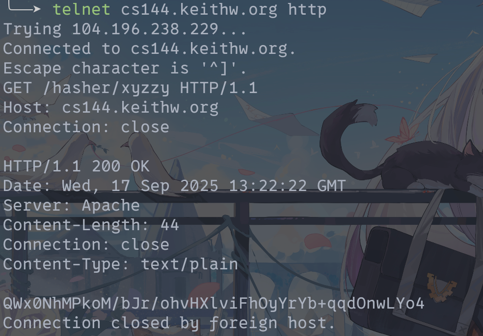

**English:**
CS144: Introduction to Computer Networking
Lab Checkpoint 3: the TCP sender
Winter 2025

**中文:**
CS144: 计算机网络导论
实验检查点 3：TCP 发送方
冬季 2025

---

**English:**
Due: Sunday, Feb. 9, 11:59 p.m. (late deadline: Feb. 12, 7 p.m.)
Collaboration Policy: Same as checkpoint 0. Please do not look at other students' code or solutions to past versions of these assignments. Please fully disclose any collaborators or any gray areas in your writeup—disclosure is the best policy.

**中文:**
截止日期：周日，2 月 9 日，晚上 11:59（延迟截止日期：2 月 12 日，晚上 7 点）
合作政策：与检查点 0 相同。请不要查看其他学生的代码或这些作业过去版本的解决方案。请在你的报告中完全披露任何合作者或任何灰色地带——披露是最好的策略。

---

### **English:** 0 Overview
### **中文:** 0 概述

---

**English:**
Suggestion: read the whole lab document before implementing.
In Checkpoint 0, you implemented the abstraction of a flow-controlled byte stream (ByteStream). In Checkpoints 1 and 2, you implemented the tools that translate from segments carried in unreliable datagrams to an incoming byte stream: the Reassembler and TCPReceiver.
Now, in Checkpoint 3, you'll implement the other side of the connection. The TCPSender is a tool that translates from an outbound byte stream to segments that will become the payloads of unreliable datagrams. Finally, in Checkpoint 4, you'll combine your work from the previous to labs to create a working TCP implementation: a TCPPeer that contains a TCPSender and TCPReceiver. You'll use this to talk to a classmate and to peers across the Internet—real servers that speak TCP.

**中文:**
建议：在实现之前阅读整个实验文档。
在检查点 0 中，你实现了一个流量控制字节流（`ByteStream`）的抽象。在检查点 1 和 2 中，你实现了将不可靠数据报中携带的段转换为传入字节流的工具：`Reassembler` 和 `TCPReceiver`。
现在，在检查点 3 中，你将实现连接的另一端。`TCPSender` 是一个将出站字节流转换为段的工具，这些段将成为不可靠数据报的有效载荷。最后，在检查点 4 中，你将把之前实验的工作结合起来，创建一个可工作的 TCP 实现：一个包含 `TCPSender` 和 `TCPReceiver` 的 `TCPPeer`。你将用它来与同学以及互联网上的对等方——即讲 TCP 的真实服务器——进行通信。

---

### **English:** 1 Getting started
### **中文:** 1 开始

---

**English:**
Your implementation of a TCPSender will use the same Minnow library that you used in Checkpoints 0–2, with additional classes and tests. To get started:
1. Make sure you have committed all your solutions to Checkpoint 1. Please don't modify any files outside the top level of the `src` directory, or `webget.cc`. You may have trouble merging the Checkpoint 1 starter code otherwise.
2. While inside the repository for the lab assignments, run `git fetch --all` to retrieve the most recent version of the lab assignment.
3. Download the starter code for Checkpoint 3 by running `git merge origin/check3-startercode` (If you have renamed the "origin" remote to be something else, you might need to use a different name here, e.g. `git merge upstream/check3-startercode`.)
4. Make sure your build system is properly set up: `cmake -S . -B build`
5. Compile the source code: `cmake --build build`
6. Open and start editing the `writeups/check3.md` file. This is the template for your lab writeup and will be included in your submission.
7. Reminder: please make frequent small commits in your local Git repository as you work. If you need help to make sure you're doing this right, please ask a classmate or the teaching staff for help. You can use the `git log` command to see your Git history.

**中文:**
你的 `TCPSender` 实现将使用与检查点 0–2 中相同的 Minnow 库，但会增加一些额外的类和测试。开始步骤如下：
1.  确保你已经提交了检查点 1 的所有解决方案。请不要修改 `src` 顶级目录之外的任何文件，或 `webget.cc`。否则，在合并检查点 1 的起始代码时可能会遇到麻烦。
2.  在实验作业的仓库内，运行 `git fetch --all` 来获取实验作业的最新版本。
3.  通过运行 `git merge origin/check3-startercode` 来下载检查点 3 的起始代码。（如果你已将“origin”远程重命名为其他名称，你可能需要在此处使用不同的名称，例如 `git merge upstream/check3-startercode`。）
4.  确保你的构建系统已正确设置：`cmake -S . -B build`
5.  编译源代码：`cmake --build build`
6.  打开并开始编辑 `writeups/check3.md` 文件。这是你实验报告的模板，并将包含在你的提交中。
7.  **提醒**：请在你工作时，在你的本地 Git 仓库中进行频繁的小提交。如果你需要帮助以确保你做得正确，请询问同学或教学人员。你可以使用 `git log` 命令查看你的 Git 历史。

---

### **English:** 2 Checkpoint 3: The TCP Sender
### **中文:** 2 检查点 3：TCP 发送方

---

**English:**
TCP is a protocol that reliably conveys a pair of flow-controlled byte streams (one in each direction) over unreliable datagrams. Two party participate in the TCP connection, and each party is a peer of the other. Each peer acts as both “sender”(of its own outgoing byte-stream) and “receiver” (of an incoming byte-stream) at the same time.
This week, you'll implement the “sender" part of TCP, responsible for reading from a ByteStream (created and written to by some sender-side application), and turning the stream into a sequence of outgoing TCP segments. On the remote side, a TCP receiver¹ transforms those segments (those that arrive—they might not all make it) back into the original byte stream, and sends acknowledgments and window advertisements back to the sender.
It will be your TCPSender's responsibility to:
* Keep track of the receiver's window (receiving incoming `TCPReceiverMessages` with their `acknos` and `window sizes`)
* Fill the window when possible, by reading from the `ByteStream`, creating new TCP segments (including SYN and FIN flags if needed), and sending them. The sender should keep sending segments until either the window is full or the outbound `ByteStream` has nothing more to send.
* Keep track of which segments have been sent but not yet acknowledged by the receiver—we call these "outstanding” segments
* Re-send outstanding segments if enough time passes since they were sent, and they haven't been acknowledged yet

**中文:**
TCP 是一个通过不可靠的数据报可靠地传输一对流量控制字节流（每个方向一个）的协议。两个参与方参与 TCP 连接，每一方都是另一方的对等点。每个对等点同时扮演“发送方”（发送自己的出站字节流）和“接收方”（接收一个入站字节流）的角色。
本周，你将实现 TCP 的“发送方”部分，负责从一个 `ByteStream`（由某个发送端应用程序创建和写入）中读取数据，并将该流转换成一系列出站的 TCP 段。在远程端，一个 TCP 接收器¹ 将这些段（那些到达的——它们可能不会全部到达）转换回原始的字节流，并向发送方发送确认和窗口通告。
你的 `TCPSender` 将负责：
*   跟踪接收方的窗口（通过接收传入的 `TCPReceiverMessages` 及其 `acknos` 和 `window sizes`）
*   在可能的情况下填充窗口，通过从 `ByteStream` 读取数据，创建新的 TCP 段（如果需要，包括 SYN 和 FIN 标志），并发送它们。发送方应持续发送段，直到窗口被填满或出站 `ByteStream` 没有更多内容可发送。
*   跟踪哪些段已发送但尚未被接收方确认——我们称这些为“未完成”的段
*   如果自发送以来经过了足够的时间，并且尚未被确认，则重新发送未完成的段

---

**English:**
*Why am I doing this? The basic principle is to send whatever the receiver will allow us to send (filling the window), and keep retransmitting until the receiver acknowledges each segment. This is called “automatic repeat request" (ARQ). The sender divides the byte stream up into segments and sends them, as much as the receiver's window allows. Thanks to your work last week, we know that the remote TCP receiver can reconstruct the byte stream as long as it receives each index-tagged byte at least once—no matter the order. The sender's job is to make sure the receiver gets each byte at least once.

**中文:**
*我为什么要做这个？ 基本原则是发送接收方允许我们发送的任何内容（填满窗口），并持续重传，直到接收方确认每个段。这被称为“自动重传请求”（ARQ）。发送方将字节流分割成段，并根据接收方窗口的允许程度发送它们。多亏了你上周的工作，我们知道远程 TCP 接收方只要至少一次接收到每个带有索引标记的字节，就可以重建字节流——无论顺序如何。发送方的工作是确保接收方至少一次收到每个字节。

---

**English:**
¹It's important to remember that the receiver can be *any* implementation of a valid TCP receiver—it won't necessarily be your own TCPReceiver. One of the valuable things about Internet standards is how they establish a common language between endpoints that may otherwise act very differently.

**中文:**
¹重要的是要记住，接收方可以是*任何*有效的 TCP 接收器的实现——它不一定是你自己的 `TCPReceiver`。互联网标准的宝贵之处在于，它们如何在可能行为截然不同的端点之间建立一种通用语言。

---

#### **English:** 2.1 How does the TCPSender know if a segment was lost?
#### **中文:** 2.1 TCPSender 如何知道一个段是否丢失？

---

**English:**
Your TCPSender will be sending a bunch of `TCPSenderMessages`. Each will contain a (possibly-empty) substring from the outgoing `ByteStream`, indexed with a sequence number to indicate its position in the stream, and marked with the SYN flag at the beginning of the stream, and FIN flag at the end.
In addition to sending those segments, the TCPSender also has to keep track of its outstanding segments until the sequence numbers they occupy have been fully acknowledged. Periodically, the owner of the TCPSender will call the TCPSender's `tick` method, indicating the passage of time. The TCPSender is responsible for looking through its collection of outstanding `TCPSenderMessages` and deciding if the oldest-sent segment has been outstanding for too long without acknowledgment (that is, without *all* of its sequence numbers being acknowledged). If so, it needs to be retransmitted (sent again).

**中文:**
你的 `TCPSender` 将会发送大量的 `TCPSenderMessages`。每个消息将包含一个来自出站 `ByteStream` 的（可能为空的）子字符串，用一个序列号索引以指示其在流中的位置，并在流的开始处标记 SYN 标志，在结束处标记 FIN 标志。
除了发送这些段之外，`TCPSender` 还必须跟踪其未完成的段，直到它们占用的序列号被完全确认为止。`TCPSender` 的所有者会定期调用 `TCPSender` 的 `tick` 方法，以表示时间的流逝。`TCPSender` 负责检查其未完成的 `TCPSenderMessages` 集合，并决定最早发送的段是否在没有确认的情况下（即，没有其*所有*序列号都被确认）悬置了太长时间。如果是，则需要重传（再次发送）。

---

**English:**
Here are the rules for what “outstanding for too long" means.² You're going to be implementing this logic, and it's a little detailed, but we don't want you to be worrying about hidden test cases trying to trip you up or treating this like a word problem on the SAT. We'll give you some reasonable unit tests this week, and fuller integration tests in Lab 4 once you've finished the whole TCP implementation. As long as you pass those tests 100% and your implementation is reasonable, you'll be fine.

**中文:**
以下是“悬置太久”的规则。²你将要实现这个逻辑，它有点详细，但我们不希望你担心隐藏的测试用例会试图让你上当，或者像对待 SAT 上的文字题一样对待这个问题。本周我们会给你一些合理的单元测试，一旦你完成了整个 TCP 实现，我们将在实验 4 中提供更全面的集成测试。只要你 100% 通过这些测试并且你的实现是合理的，你就没问题。

---

**English:**
*Why am I doing this? The overall goal is to let the sender detect when segments go missing and need to be resent, in a timely manner. The amount of time to wait before resending is important: you don't want the sender to wait too long to resend a segment (because that delays the bytes flowing to the receiving application), but you also don't want it to resend a segment that was going to be acknowledged if the sender had just waited a little longer—that wastes the Internet's precious capacity.

**中文:**
*我为什么要做这个？ 总体目标是让发送方及时检测到段何时丢失并需要重传。重传前等待的时间量很重要：你不希望发送方等待太长时间才重传一个段（因为这会延迟流向接收应用程序的字节），但你也不希望它重传一个如果发送方再多等一会儿就会被确认的段——那会浪费互联网宝贵的容量。

---

**English:**
1. Every few milliseconds, your TCPSender's `tick` method will be called with an argument that tells it how many milliseconds have elapsed since the last time the method was called. Use this to maintain a notion of the total number of milliseconds the TCPSender has been alive. Please don't try to call any “time” or “clock” functions from the operating system or CPU—the `tick` method is your only access to the passage of time. That keeps things deterministic and testable.
2. When the TCPSender is constructed, it's given an argument that tells it the “initial value" of the retransmission timeout (RTO). The RTO is the number of milliseconds to wait before resending an outstanding TCP segment. The value of the RTO will change over time, but the “initial value” stays the same. The starter code saves the "initial value" of the RTO in a member variable called `initial_RTO_ms_`.
3. You'll implement the retransmission timer: an alarm that can be started at a certain time, and the alarm goes off (or “expires”) once the RTO has elapsed. We emphasize that this notion of time passing comes from the `tick` method being called—not by getting the actual time of day.
4. Every time a segment containing data (nonzero length in sequence space) is sent (whether it's the first time or a retransmission), if the timer is not running, start it running so that it will expire after RTO milliseconds (for the current value of RTO). By "expire," we mean that the time will run out a certain number of milliseconds in the future.
5. When all outstanding data has been acknowledged, stop the retransmission timer.
6. If `tick` is called and the retransmission timer has expired:
   (a) Retransmit the earliest (lowest sequence number) segment that hasn't been fully acknowledged by the TCP receiver. You'll need to be storing the outstanding segments in some internal data structure that makes it possible to do this.
   (b) If the window size is nonzero:
       i. Keep track of the number of consecutive retransmissions, and increment it because you just retransmitted something. Your `TCPConnection` will use this information to decide if the connection is hopeless (too many consecutive retransmissions in a row) and needs to be aborted.
       ii. Double the value of RTO. This is called “exponential backoff”—it slows down retransmissions on lousy networks to avoid further gumming up the works.
   (c) Reset the retransmission timer and start it such that it expires after RTO milliseconds (taking into account that you may have just doubled the value of RTO!).
7. When the receiver gives the sender an `ackno` that acknowledges the successful receipt of new data (the `ackno` reflects an absolute sequence number bigger than any previous `ackno`):
   (a) Set the RTO back to its “initial value."
   (b) If the sender has any outstanding data, restart the retransmission timer so that it will expire after RTO milliseconds (for the current value of RTO).
   (c) Reset the count of “consecutive retransmissions” back to zero.
   You might choose to implement the functionality of the retransmission timer in a separate class, but it's up to you. If you do, please add it to the existing files (`tcp_sender.hh` and `tcp_sender.cc`).

**中文:**
1.  每隔几毫秒，你的 `TCPSender` 的 `tick` 方法将被调用，并带有一个参数，告知自上次调用该方法以来经过了多少毫秒。用这个来维持 `TCPSender` 已经存活的总毫秒数的概念。**请不要尝试从操作系统或 CPU 调用任何“时间”或“时钟”函数**——`tick` 方法是你唯一获取时间流逝的途径。这使得事情具有确定性和可测试性。
2.  当 `TCPSender` 被构造时，会给它一个参数，告知它重传超时（RTO）的“初始值”。RTO 是在重传一个未完成的 TCP 段之前等待的毫秒数。RTO 的值会随着时间变化，但“初始值”保持不变。起始代码将 RTO 的“初始值”保存在名为 `initial_RTO_ms_` 的成员变量中。
3.  你将实现**重传计时器**：一个可以在特定时间启动的警报，一旦 RTO 耗尽，警报就会响起（或“到期”）。我们强调，时间流逝的概念来自于 `tick` 方法的调用——而不是通过获取实际的当日时间。
4.  每当发送一个包含数据（在序列号空间中长度非零）的段时（无论是第一次发送还是重传），如果计时器没有运行，**启动它**，使其在 RTO 毫秒后到期（使用 RTO 的当前值）。我们所说的“到期”，是指在未来某个毫秒数后时间会用完。
5.  当所有未完成的数据都已被确认时，**停止**重传计时器。
6.  如果 `tick` 被调用且重传计时器已到期：
    (a) **重传** TCP 接收方尚未完全确认的最早的（最低序列号）段。你需要将未完成的段存储在某个内部数据结构中，以便能够做到这一点。
    (b) 如果**窗口大小非零**：
        i.  跟踪**连续重传**的次数，并因为你刚刚重传了某样东西而将其递增。你的 `TCPConnection` 将使用此信息来决定连接是否无望（连续重传次数过多）并需要中止。
        ii. **将 RTO 的值加倍**。这被称为“指数退避”——它减慢了在糟糕网络上的重传，以避免进一步堵塞网络。
    (c) **重置**重传计时器并启动它，使其在 RTO 毫秒后到期（考虑到你可能刚刚将 RTO 的值加倍了！）。
7.  当接收方向发送方提供一个 `ackno`，确认成功接收到**新**数据时（`ackno` 反映的绝对序列号大于之前任何 `ackno`）：
    (a) 将 RTO **设置**回其“初始值”。
    (b) 如果发送方有任何未完成的数据，**重新启动**重传计时器，使其在 RTO 毫秒后到期（使用 RTO 的当前值）。
    (c) 将“连续重传”的计数**重置**为零。
    你可以选择在一个单独的类中实现重传计时器的功能，但这取决于你。如果你这样做，请将其添加到现有文件（`tcp_sender.hh` 和 `tcp_sender.cc`）中。

---

#### **English:** 2.2 Implementing the TCP sender
#### **中文:** 2.2 实现 TCP 发送方

---

**English:**
Okay! We've discussed the basic idea of *what* the TCP sender does (given an outgoing ByteStream, split it up into segments, send them to the receiver, and if they don't get acknowledged soon enough, keep resending them). And we've discussed *when* to conclude that an outstanding segment was lost and needs to be resend.
Now it's time for the concrete interface that your TCPSender will provide. There are four important events that it needs to handle:
1. `void push( const TransmitFunction& transmit );`
The TCPSender is asked to fill the window from the outbound byte stream: it reads from the stream and sends as many TCPSenderMessages as possible, as long as there are new bytes to be read and space available in the window. It sends them by calling the provided `transmit()` function on them.
You'll want to make sure that every `TCPSenderMessage` you send fits fully inside the receiver's window. Make each individual message as big as possible, but no bigger than the value given by `TCPConfig::MAX_PAYLOAD_SIZE`.
You can use the `TCPSenderMessage::sequence_length()` method to count the total number of sequence numbers occupied by a segment. Remember that the SYN and FIN flags also occupy a sequence number each, which means that they occupy space in the window.
2. `void receive( const TCPReceiverMessage& msg );`
A message is received from the receiver, conveying the new left (= `ackno`) and right (= `ackno` + `window size`) edges of the window. The `TCPSender` should look through its collection of outstanding segments and remove any that have now been fully acknowledged (the `ackno` is greater than all of the sequence numbers in the segment).
3. `void tick( uint64_t ms_since_last_tick, const TransmitFunction& transmit );`
Time has passed—a certain number of milliseconds since the last time this method was called. The sender may need to retransmit an outstanding segment; it can call the `transmit()` function to do this. (Reminder: please don't try to use real-world “clock” or “gettimeofday” functions in your code; the only reference to time passing comes from the `ms_since_last_tick` argument.)
4. `TCPSenderMessage make_empty_message() const;`
The TCPSender should generate and send a zero-length message with the sequence number set correctly. This is useful if the peer wants to send a `TCPReceiverMessage` (e.g. because it needs to acknowledge something from the peer's sender) and needs to generate a `TCPSenderMessage` to go with it.
Note: a segment like this one, which occupies no sequence numbers, doesn't need to be kept track of as “outstanding” and won't ever be retransmitted.

**中文:**
好的！我们已经讨论了 TCP 发送方*做什么*的基本思想（给定一个出站的 `ByteStream`，将其分割成段，发送给接收方，如果它们没有很快得到确认，就一直重传）。我们也讨论了*何时*断定一个未完成的段已丢失并需要重传。
现在是时候来看一下你的 `TCPSender` 将提供的具体接口了。它需要处理四个重要的事件：
1.  `void push( const TransmitFunction& transmit );`
    `TCPSender` 被要求从出站字节流中填充窗口：它从流中读取并发送尽可能多的 `TCPSenderMessages`，只要有新的字节可读且窗口中有可用空间。它通过调用提供的 `transmit()` 函数来发送它们。
    你要确保你发送的每个 `TCPSenderMessage` 都完全适合接收方的窗口。让每个单独的消息尽可能大，但不要超过 `TCPConfig::MAX_PAYLOAD_SIZE` 给定的值。
    你可以使用 `TCPSenderMessage::sequence_length()` 方法来计算一个段占用的总序列号数。请记住，SYN 和 FIN 标志也各占用一个序列号，这意味着它们也占用窗口中的空间。
2.  `void receive( const TCPReceiverMessage& msg );`
    从接收方收到一条消息，传达了窗口的新的左边缘（= `ackno`）和右边缘（= `ackno` + `window size`）。`TCPSender` 应该检查其未完成的段的集合，并移除任何现在已被完全确认的段（`ackno` 大于该段中的所有序列号）。
3.  `void tick( uint64_t ms_since_last_tick, const TransmitFunction& transmit );`
    时间流逝了——自上次调用此方法以来经过了一定的毫秒数。发送方可能需要重传一个未完成的段；它可以调用 `transmit()` 函数来做到这一点。（提醒：请不要在你的代码中使用现实世界的“时钟”或“gettimeofday”函数；唯一的时间流逝参考来自于 `ms_since_last_tick` 参数。）
4.  `TCPSenderMessage make_empty_message() const;`
    `TCPSender` 应该生成并发送一个序列号设置正确的零长度消息。如果对等方想要发送一个 `TCPReceiverMessage`（例如，因为它需要确认来自对等方发送方的某些内容）并且需要生成一个 `TCPSenderMessage` 来附带它，这很有用。
    注意：像这样一个不占用任何序列号的段，不需要作为“未完成”来跟踪，也永远不会被重传。

---

**English:**
To complete Checkpoint 3, please review the full interface in `src/tcp_sender.hh` implement the complete `TCPSender` public interface in the `tcp_sender.hh` and `tcp_sender.cc` files. We expect you'll want to add private methods and member variables, and possibly a helper class.

**中文:**
要完成检查点 3，请查看 `src/tcp_sender.hh` 中的完整接口，并在 `tcp_sender.hh` 和 `tcp_sender.cc` 文件中实现完整的 `TCPSender` 公共接口。我们预计你将需要添加私有方法和成员变量，可能还有一个辅助类。

---

#### **English:** 2.3 FAQs and special cases
#### **中文:** 2.3 常见问题解答和特殊情况

---

**English:**
*   What should my TCPSender assume as the receiver's window size before the `receive` method informs it otherwise?
    One.
*   What do I do if an acknowledgment only partially acknowledges some outstanding segment? Should I try to clip off the bytes that got acknowledged?
    A TCP sender *could* do this, but for purposes of this class, there's no need to get fancy. Treat each segment as fully outstanding until it's been fully acknowledged—all of the sequence numbers it occupies are less than the `ackno`.
*   If I send three individual segments containing “a,” “b,” and “c,” and they never get acknowledged, can I later retransmit them in one big segment that contains “abc”? Or do I have to retransmit each segment individually?
    Again: a TCP sender *could* do this, but for purposes of this class, no need to get fancy. Just keep track of each outstanding segment individually, and when the retransmission timer expires, send the earliest outstanding segment again.
*   Should I store empty segments in my “outstanding” data structure and retransmit them when necessary?
    No—the only segments that should be tracked as outstanding, and possibly retransmitted, are those that convey some data—i.e. that consume some length in sequence space. A segment that occupies no sequence numbers (no SYN, payload, or FIN) doesn't need to be remembered or retransmitted.
*   Where can I read if there are more FAQs after this PDF comes out?
    Please check the website (https://cs144.github.io/lab_faq.html) and Ed regularly.

**中文:**
*   在 `receive` 方法通知我的 `TCPSender` 接收方的窗口大小之前，它应该假设窗口大小是多少？
    一。
*   如果一个确认只部分确认了某个未完成的段，我该怎么办？我应该尝试剪掉被确认的字节吗？
    一个 TCP 发送方*可以*这样做，但就本课程而言，没必要搞得那么花哨。将每个段视为完全未完成，直到它被完全确认——它占用的所有序列号都小于 `ackno`。
*   如果我发送了三个分别包含“a”、“b”和“c”的独立段，并且它们一直没有被确认，我之后能在一个包含“abc”的大段中重传它们吗？还是我必须分别重传每个段？
    再次强调：一个 TCP 发送方*可以*这样做，但就本课程而言，没必要搞得那么花哨。只需单独跟踪每个未完成的段，当重传计时器到期时，再次发送最早的未完成段。
*   我应该在我的“未完成”数据结构中存储空段，并在必要时重传它们吗？
    不——唯一应该作为未完成被跟踪，并可能被重传的段是那些传达了一些数据——即在序列号空间中消耗了一些长度的段。一个不占用任何序列号（没有 SYN、有效载荷或 FIN）的段不需要被记住或重传。
*   在这份 PDF 发布后，如果还有更多的常见问题解答，我可以在哪里阅读？
    请定期查看网站（https://cs144.github.io/lab_faq.html）和 Ed。

---

### **English:** 3 Development and debugging advice
### **中文:** 3 开发和调试建议

---

**English:**
1. Implement the TCPSender's public interface (and any private methods or functions you'd like) in the file `tcp_sender.cc`. You may add any private members you like to the `TCPSender` class in `tcp_sender.hh`.
2. You can test your code with `cmake --build build --target check3`
3. Please re-read the section on "using Git" in the Checkpoint 0 document, and remember to keep the code in the Git repository it was distributed in on the `main` branch. Make small commits, using good commit messages that identify what changed and why.
4. Please work to make your code readable to the CA who will be grading it for style. Use reasonable and clear naming conventions for variables. Use comments to explain complex or subtle pieces of code. Use “defensive programming”—explicitly check preconditions of functions or invariants, and throw an exception if anything is ever wrong. Use modularity in your design—identify common abstractions and behaviors and factor them out when possible. Blocks of repeated code and enormous functions will make it hard to follow your code.

**中文:**
1.  在 `tcp_sender.cc` 文件中实现 `TCPSender` 的公共接口（以及你喜欢的任何私有方法或函数）。你可以在 `tcp_sender.hh` 中的 `TCPSender` 类中添加任何你喜欢的私有成员。
2.  你可以用 `cmake --build build --target check3` 来测试你的代码。
3.  请重读检查点 0 文档中关于“使用 Git”的部分，并记住将代码保存在其分发时所在的 `main` 分支的 Git 仓库中。进行小的提交，并使用能够说明更改内容和原因的良好提交信息。
4.  请努力使你的代码对于将要对其进行风格评分的助教（CA）来说是可读的。为变量使用合理且清晰的命名约定。使用注释来解释复杂或微妙的代码片段。使用“防御性编程”——明确检查函数或不变量的前提条件，如果出现任何错误就抛出异常。在你的设计中使用模块化——识别共同的抽象和行为，并在可能时将它们提取出来。重复的代码块和庞大的函数将使你的代码难以理解。

---

### **English:** 4 Hands-on activity
### **中文:** 4 动手实践活动

---

**English:**
Congratulations—you have made a fully working implementation of the Transmission Control Protocol, implementations of which are arguably the most prevalent computer program on the planet. It's time to take a victory lap! You'll communicate with Linux's TCP and with a lab partner, and then you'll modify your `webget` (from checkpoint 0) to use your TCP implementation. In your writeup, describe what you did, answer the questions below, and try to find something interesting to discuss!

**中文:**
恭喜——你已经完成了一个功能齐全的传输控制协议实现，而该协议的实现可以说是地球上最流行的计算机程序。是时候庆祝胜利了！你将与 Linux 的 TCP 和一个实验伙伴进行通信，然后你将修改你的 `webget`（来自检查点 0）以使用你自己的 TCP 实现。在你的报告中，描述你做了什么，回答下面的问题，并试着找一些有趣的东西来讨论！

---

#### **English:** 4.1 Experiments within your own VM
#### **中文:** 4.1 在你自己的虚拟机内进行实验

---

**English:**
We've given you a client program (`./build/apps/tcp_ipv4`) that uses your TCPSender and TCPReceiver to speak TCP-over-IP over the Internet.³ We've also given you a similar program (`./build/apps/tcp_native`) that uses a Linux `TCPSocket`.
The big question: Can your TCP implementation (`tcp_ipv4`) interoperate with Linux's TCP (`tcp_native`)?

**中文:**
我们给了你一个客户端程序（`./build/apps/tcp_ipv4`），它使用你的 `TCPSender` 和 `TCPReceiver` 通过互联网进行 TCP-over-IP 通信。³我们也给了你一个类似的程序（`./build/apps/tcp_native`），它使用 Linux 的 `TCPSocket`。
一个大问题：你的 TCP 实现（`tcp_ipv4`）能与 Linux 的 TCP（`tcp_native`）互操作吗？

---

**English:**
³If you're curious how this program works, the `tcp_peer.hh` and `tcp_over_ip.cc` files are probably the interesting part of how we glued your TCPSender/TCPReceiver into a conforming TCP peer.

**中文:**
³如果你好奇这个程序是如何工作的，`tcp_peer.hh` 和 `tcp_over_ip.cc` 文件可能是关于我们如何将你的 `TCPSender/TCPReceiver` 粘合成一个符合规范的 TCP 对等点的有趣部分。

---

##### **English:** 4.1.1 Have Linux's TCP talk to itself
##### **中文:** 4.1.1 让 Linux 的 TCP 与自己对话

---

**English:**
*   First, let's do the boring part of making sure Linux's TCP implementation can talk to itself. Run Linux's TCP as a “server” (the peer that waits for an incoming SYN segment), listening on port 9090. On your VM, run: `./build/apps/tcp_native -l 0 9090`
*   Next, try using Linux's TCP as the “client”: the peer that initiates the connection by sending the first SYN segment to the server. In another terminal window on your VM, run: `./build/apps/tcp_native 169.254.144.1 9090`
*   If all goes well, the “server" will print something like `DEBUG: New connection from 169.254.144.1:36568` and the “client” will print something like `DEBUG: Connecting to 169.254.144.1:9090... DEBUG: Successfully connected to 169.254.144.1:9090.`
*   Try typing into each window, and you will see the same bytes on the other window.
*   To end a stream, type `ctrl-D` (on a line by itself) to close the `ByteStream` Writer in that direction. If all goes well, you'll see `Outbound stream...finished` on the terminal where you typed the `ctrl-D`, and `Inbound stream...finished` on the other terminal. Notice that the other peer can keep sending to the "closed" peer—each direction of the stream can be closed independently, without preventing the other direction from continuing.
*   Now end the stream in the second direction by typing `ctrl-D` (on a line by itself) in the other terminal. If all went well, both programs will quit and bring you back to the command line in both terminals. This indicates the TCP connection has finished in both directions (as discussed in class, Linux will "linger" in the background before reusing one of the port numbers to reduce the chance of a “two general's problem").

**中文:**
*   首先，让我们做点乏味的工作，确保 Linux 的 TCP 实现能与自己对话。将 Linux 的 TCP 作为“服务器”运行（等待传入 SYN 段的对等方），在端口 9090 上监听。在你的虚拟机上，运行：`./build/apps/tcp_native -l 0 9090`
*   接下来，尝试使用 Linux 的 TCP 作为“客户端”：通过向服务器发送第一个 SYN 段来发起连接的对等方。在你的虚拟机上的另一个终端窗口中，运行：`./build/apps/tcp_native 169.254.144.1 9090`
*   如果一切顺利， “服务器”将打印出类似 `DEBUG: New connection from 169.254.144.1:36568` 的内容，而“客户端”将打印出类似 `DEBUG: Connecting to 169.254.144.1:9090... DEBUG: Successfully connected to 169.254.144.1:9090.` 的内容。
*   尝试在每个窗口中输入，你会看到相同的字节出现在另一个窗口中。
*   要结束一个流，输入 `ctrl-D`（单独一行）来关闭该方向的 `ByteStream` 写入器。如果一切顺利，你将在输入 `ctrl-D` 的终端上看到 `Outbound stream...finished`，在另一个终端上看到 `Inbound stream...finished`。请注意，另一个对等方可以继续向“已关闭”的对等方发送——每个方向的流可以独立关闭，而不会阻止另一个方向继续。
*   现在在另一个终端中输入 `ctrl-D`（单独一行）来结束第二个方向的流。如果一切顺利，两个程序都将退出，并带你回到两个终端的命令行。这表明 TCP 连接已在两个方向上完成（如课堂上讨论的，Linux 会在后台“逗留”，然后才重用其中一个端口号，以减少“两将军问题”的发生几率）。

---

##### **English:** 4.1.2 Have your TCP talk to Linux's
##### **中文:** 4.1.2 让你的 TCP 与 Linux 的 TCP 对话

---

**English:**
Repeat the above steps, but connect your TCP implementation to Linux's. First, run `sudo ./scripts/tun.sh start 144` to give your implementation permission to send raw Internet datagrams without needing to be root. You'll have to rerun this command any time you reboot your VM.
Then, rerun the above experiment, replacing one of the programs (the client or server) with `tcp_ipv4` (which is your TCP implementation). Does the connection still get established as before, and can each peer still type at the other and have the text appear on the other peer's window? If so, pat yourself on the back (and we'll shake your hand)—you've earned it! If not... time to start debugging. You can capture the TCP segments with a command like `sudo rm -f /tmp/capture.raw; sudo tcpdump -n -w /tmp/capture.raw -i tun144 --print --packet-buffered;` the resulting `/tmp/capture.raw` file can be visualized in wireshark as before.
After you've typed a little in each direction, try closing one of the `ByteStreams` and keep typing a little in the other direction. Do both programs quit cleanly after both streams have finished with a `ctrl-D`? They should—although you may need to see `tcp_ipv4` wait a little to reduce the chance of a “two general's problem.” When does it need to wait (when it's the first to close or the second to close)? Does this match what was discussed in class?

**中文:**
重复上述步骤，但将你的 TCP 实现连接到 Linux 的 TCP。首先，运行 `sudo ./scripts/tun.sh start 144`，给予你的实现发送原始互联网数据报的权限，而无需 root 权限。每次重启虚拟机时，你都必须重新运行此命令。
然后，重新运行上述实验，将其中一个程序（客户端或服务器）替换为 `tcp_ipv4`（这是你的 TCP 实现）。连接是否仍像以前一样建立，每个对等方是否仍能向对方输入并看到文本出现在对方的窗口中？如果是，拍拍自己的背（我们会和你握手）——你做到了！如果不是……是时候开始调试了。你可以用类似 `sudo rm -f /tmp/capture.raw; sudo tcpdump -n -w /tmp/capture.raw -i tun144 --print --packet-buffered;` 的命令捕获 TCP 段；生成的 `/tmp/capture.raw` 文件可以像以前一样在 wireshark 中可视化。
在每个方向都输入一点内容后，尝试关闭其中一个 `ByteStream`，并在另一个方向继续输入一点。在两个流都用 `ctrl-D` 完成后，两个程序是否都干净地退出了？它们应该会——尽管你可能需要看到 `tcp_ipv4` 等待一小会儿，以减少“两将军问题”的发生几率。它什么时候需要等待（当它是第一个关闭时还是第二个关闭时）？这与课堂上讨论的内容是否匹配？

---

##### **English:** 4.1.3 Try to pass the “one megabyte challenge”
##### **中文:** 4.1.3 尝试通过“一百万字节挑战”

---

**English:**
Once it looks like you can have a basic conversation, try sending a file between `tcp_ipv4` (your TCP) and `tcp_native` (Linux's TCP).
To create a random file that's 12345 bytes as "/tmp/big.txt":
`dd if=/dev/urandom bs=12345 count=1 of=/tmp/big.txt`
You can choose the direction of transmission—i.e. whether the client or server is the one to send the file.
To have the server send the file as soon as it accepts an incoming connection, redirect standard input to read from the file:
`./build/apps/tcp_native -l 0 9090 < /tmp/big.txt`
To have the client receive the file, close off its outgoing stream by redirecting from `/dev/null`, and redirect standard output to a second file named "/tmp/big-received.txt":
`</dev/null ./build/apps/tcp_ipv4 169.254.144.1 9090 > /tmp/big-received.txt`
Or to have the server receive the file:
`</dev/null ./build/apps/tcp_native -l 0 9090 > /tmp/big-received.txt`
Or to have the client send the file:
`./build/apps/tcp_ipv4 169.254.144.1 9090 < /tmp/big.txt`
To compare two files and make sure they're the same:
`sha256sum /tmp/big.txt` or `sha256sum /tmp/big-received.txt`
If the SHA-256 hashes match, you can be almost certain the file was transmitted correctly.
Try this with a tiny file (12 bytes), then 65534 bytes (a little less than 2¹⁶), then 65537 bytes (a little more than 2¹⁶), then 200000 bytes, then the full megabyte (1000000 bytes). If they all match, give yourself an even bigger pat on the back! If not... time to debug (possibly with tcpdump and wireshark as described above).

**中文:**
一旦看起来你可以进行基本的对话，就尝试在 `tcp_ipv4`（你的 TCP）和 `tcp_native`（Linux 的 TCP）之间发送一个文件。
要创建一个 12345 字节的随机文件，名为“/tmp/big.txt”：
`dd if=/dev/urandom bs=12345 count=1 of=/tmp/big.txt`
你可以选择传输方向——即客户端或服务器是发送文件的一方。
要让服务器在接受传入连接后立即发送文件，将标准输入重定向以从文件中读取：
`./build/apps/tcp_native -l 0 9090 < /tmp/big.txt`
要让客户端接收文件，通过从 `/dev/null` 重定向来关闭其出站流，并将标准输出重定向到名为“/tmp/big-received.txt”的第二个文件：
`</dev/null ./build/apps/tcp_ipv4 169.254.144.1 9090 > /tmp/big-received.txt`
或者让服务器接收文件：
`</dev/null ./build/apps/tcp_native -l 0 9090 > /tmp/big-received.txt`
或者让客户端发送文件：
`./build/apps/tcp_ipv4 169.254.144.1 9090 < /tmp/big.txt`
要比较两个文件并确保它们相同：
`sha256sum /tmp/big.txt` 或 `sha256sum /tmp/big-received.txt`
如果 SHA-256 哈希值匹配，你几乎可以肯定文件被正确传输了。
用一个很小的文件（12 字节），然后是 65534 字节（略小于 2¹⁶），然后是 65537 字节（略大于 2¹⁶），然后是 200000 字节，最后是完整的一百万字节（1000000 字节）来尝试这个。如果它们都匹配，给自己一个更大的鼓励吧！如果不是……是时候调试了（可能需要用到上面描述的 tcpdump 和 wireshark）。

---

#### **English:** 4.2 Reach out and talk to a friend
#### **中文:** 4.2 联络并与朋友交谈

---

**English:**
If everything works above, try communicating with a labmate over the Internet! One of you will run `tcp_native` as a server, as above. The other will run `tcp_ipv4` as the client, connecting to the labmate's address on the CS144 private network (10.144....).
Can you type to each other and successfully end the two streams cleanly? And if so, can you pass the one-megabyte challenge (sending a random 1000000-byte file successfully over the Internet to your labmate's VM, with the SHA-256 hashes matching perfectly on both sides)? If so, congratulations... now trade places and try sending the file in the other direction!
What's the biggest file that you have the patience to successfully send to your labmate? In your lab report, include the sizes of the two files (the output of `ls -l /tmp/big.txt` for the sender and `ls -l /tmp/big-received.txt` for the receiver) and the results of `sha256sum /tmp/big.txt` (on the sender's VM) and `sha256sum /tmp/big-received.txt` (on the receiver's).

**中文:**
如果以上一切正常，尝试通过互联网与实验伙伴通信！你们其中一人将像上面那样作为服务器运行 `tcp_native`。另一人将作为客户端运行 `tcp_ipv4`，连接到实验伙伴在 CS144 私有网络上的地址（10.144....）。
你们能互相输入并成功地干净地结束两个流吗？如果是，你能通过一百万字节挑战吗（通过互联网成功地向你实验伙伴的虚拟机发送一个随机的 1000000 字节文件，并且两边的 SHA-256 哈希值完全匹配）？如果是，恭喜……现在交换角色，并尝试在另一个方向发送文件！
你有耐心成功地发送给你实验伙伴的最大的文件是多大？在你的实验报告中，包括两个文件的大小（发送方的 `ls -l /tmp/big.txt` 和接收方的 `ls -l /tmp/big-received.txt` 的输出）以及 `sha256sum /tmp/big.txt`（在发送方的虚拟机上）和 `sha256sum /tmp/big-received.txt`（在接收方的）的结果。

---

#### **English:** 4.3 `webget` revisited
#### **中文:** 4.3 重访 `webget`

---

**English:**
Remember your `webget.cc` that you wrote in Checkpoint 0? It used a TCP implementation (`TCPSocket`) provided by the Linux kernel. We'd like you to switch it to use your own TCP implementation without changing anything else. We think that all you'll need to do is:
*   Replace `#include "socket.hh"` with `#include "tcp_minnow_socket.hh"`
*   Replace the `TCPSocket` type with `CS144TCPSocket`
*   At the end of your `get_URL()` function, add a call to `socket.wait_until_closed()`
    *Why am I doing this? Normally the Linux kernel takes care of waiting for TCP connections to reach “clean shutdown” (and give up their port reservations) even after user processes have exited. But because your TCP implementation is all in user space, there's nothing else to keep track of the connection state except your program. Adding this call makes the socket wait until the connection is fully closed.
    Recompile, and run `make check_webget` to confirm that you've gone full-circle: you've written a basic Web fetcher on top of your own complete TCP “stack”, and it still successfully talks to a real webserver. If you have trouble, try running the program manually: `./build/apps/webget cs144.keithw.org /hasher/xyzzy`. You'll get some debugging output on the terminal that may be helpful.

**中文:**
还记得你在检查点 0 中写的 `webget.cc` 吗？它使用了 Linux 内核提供的 TCP 实现（`TCPSocket`）。我们希望你把它切换到使用你自己的 TCP 实现，而不需要改变任何其他东西。我们认为你只需要做的是：
*   将 `#include "socket.hh"` 替换为 `#include "tcp_minnow_socket.hh"`
*   将 `TCPSocket` 类型替换为 `CS144TCPSocket`
*   在你的 `get_URL()` 函数的末尾，添加一个对 `socket.wait_until_closed()` 的调用
    *我为什么要做这个？ 通常情况下，Linux 内核负责等待 TCP 连接达到“干净关闭”（并放弃它们的端口预留），即使用户进程已经退出。但是因为你的 TCP 实现完全在用户空间，除了你的程序之外，没有其他东西来跟踪连接状态。添加这个调用会让套接字等待，直到连接完全关闭。
    重新编译，并运行 `make check_webget` 来确认你已经完成了一个完整的循环：你已经在你自己完整的 TCP“协议栈”之上编写了一个基本的网页抓取器，并且它仍然成功地与一个真实的网页服务器通信。如果你遇到麻烦，尝试手动运行程序：`./build/apps/webget cs144.keithw.org /hasher/xyzzy`。你会在终端上得到一些可能有帮助的调试输出。
*   > [!TIP]
    >
    > 在虚拟机，进行paser的时候，校验和失败导致三次握手失败
*   > [!WARNING]
    >
    > 这个hash值好像已经改变了，可能需要修改脚本中的答案值

---

### **English:** 5 Submit
### **中文:** 5 提交

---

**English:**
1. In your submission, please only make changes to the `.hh` and `.cc` files in the `src` directory (and `apps/webget.cc`). Within these files, please feel free to add private members as necessary, but please don't change the `public` interface of any of the classes.
2. Before handing in any assignment, please run these in order:
   (a) Make sure you have committed all of your changes to the Git repository. You can run `git status` to make sure there are no outstanding changes. Remember: make small commits as you code.
   (b) `cmake --build build --target format` (to normalize the coding style)
   (c) `cmake --build build --target check3` (to make sure the automated tests pass)
   (d) Optional: `cmake --build build --target tidy` (suggests improvements to follow good C++ programming practices)
3. Write a report in `writeups/check3.md`. This file should be a roughly 20-to-50-line document with no more than 80 characters per line to make it easier to read. The report should contain the following sections:
   (a) Program Structure and Design. Describe the high-level structure and design choices embodied in your code. You do not need to discuss in detail what you inherited from the starter code. Use this as an opportunity to highlight important design aspects and provide greater detail on those areas for your grading TA to understand. You are strongly encouraged to make this writeup as readable as possible by using subheadings and outlines. Please do not simply translate your program into an paragraph of English.
   (b) Alternative design choices that you considered or ideally evaluated in terms of their performance, difficulty to write (e.g., hours required to produce a bug-free implementation), difficulty to read (e.g., lines of code and their degree of subtlety or nonobvious correctness), and any other dimensions you think are interesting for the reader (or for your own past self before you did this assignment). Include any measurements if applicable.
   (c) Implementation Challenges. Describe the parts of code that you found most troublesome and explain why. Reflect on how you overcame those challenges and what helped you finally understand the concept that was giving you trouble. How did you attempt to ensure that your code maintained your assumptions, invariants, and preconditions, and in what ways did you find this easy or difficult? How did you debug and test your code?
   (d) Remaining Bugs. Point out and explain as best you can any bugs (or unhandled edge cases) that remain in the code.
   (e) Hands-on Activity. Include answers to the questions and some thoughtful commentary on the hands-on activity above.
4. Please also fill in the number of hours the assignment took you and any other comments.
5. Please let the course staff know ASAP of any problems at a lab session, or by posting a question on Ed. Good luck!

**中文:**
1.  在你的提交中，请仅对 `src` 目录中的 `.hh` 和 `.cc` 文件（以及 `apps/webget.cc`）进行更改。在这些文件中，你可以根据需要随意添加私有成员，但请不要更改任何类的 `public` 接口。
2.  在提交任何作业之前，请按以下顺序运行这些命令：
    (a) 确保你已经将所有更改提交到 Git 仓库。你可以运行 `git status` 来确保没有未完成的更改。记住：在你编码时进行小的提交。
    (b) `cmake --build build --target format` （以规范化编码风格）
    (c) `cmake --build build --target check3` （以确保自动化测试通过）
    (d) 可选：`cmake --build build --target tidy` （建议改进以遵循良好的 C++ 编程实践）
3.  在 `writeups/check3.md` 中撰写一份报告。这个文件应该是一个大约 20 到 50 行的文档，每行不超过 80 个字符，以便于阅读。报告应包含以下部分：
    (a) **程序结构与设计**。描述你代码中体现的高层结构和设计选择。你不需要详细讨论你从起始代码继承了什么。以此为契机，突出重要的设计方面，并为你的评分助教提供更详细的信息以理解这些领域。强烈建议你通过使用副标题和提纲来使这份报告尽可能可读。请不要简单地将你的程序翻译成一段英文。
    (b) **备选设计选择**。描述你曾考虑过或理想情况下评估过的其他设计选择，从它们的性能、编写难度（例如，产生一个无 bug 实现所需的小时数）、阅读难度（例如，代码行数及其精妙或不明显的正确性程度），以及你认为对读者（或对完成此作业前的你自己）有趣的其他任何维度进行评估。如果适用，请包括任何测量数据。
    (c) **实现挑战**。描述你觉得最棘手的代码部分并解释原因。反思你是如何克服这些挑战的，以及是什么帮助你最终理解了那个让你困扰的概念。你是如何尝试确保你的代码维持你的假设、不变量和前提条件的，以及在哪些方面你觉得这很容易或困难？你是如何调试和测试你的代码的？
    (d) **剩余的 Bug**。尽你所能指出并解释代码中仍然存在的任何 bug（或未处理的边缘情况）。
    (e) **动手实践活动**。包括对上述动手实践活动问题的回答和一些深思熟虑的评论。
4.  也请填写完成此作业所花费的小时数以及任何其他评论。
5.  如果在实验课上遇到任何问题，请尽快告知课程工作人员，或在 Ed 上发帖提问。祝你好运！

---

### **English:** 6 Extra Credit
### **中文:** 6 额外加分

---

**English:**
Extra credit will be rewarded for improvements to the test suite. Add a test case to one of the files in the `tests` directory (e.g. `minnow/tests/recv_connect.cc`) that catches a real bug that somebody might reasonably make that isn't already caught by the existing test suite. Please post your test on EdStem (it's okay to make this public) so we can take a look and decide whether to add it to the overall testsuite. (This opportunity will remain open—e.g. if you find a good additional test for the `Reassembler` in week 10, that's great too.)

**中文:**
对测试套件的改进将获得额外加分。在 `tests` 目录中的一个文件（例如 `minnow/tests/recv_connect.cc`）中添加一个测试用例，该用例能捕获一个别人很可能会犯的、且现有测试套件尚未能捕获的**真实**错误。请在 EdStem 上发布你的测试（可以公开），以便我们查看并决定是否将其添加到整体测试套件中。（这个机会将一直开放——例如，如果你在第 10 周为 `Reassembler` 找到了一个很好的附加测试，那也很棒。）