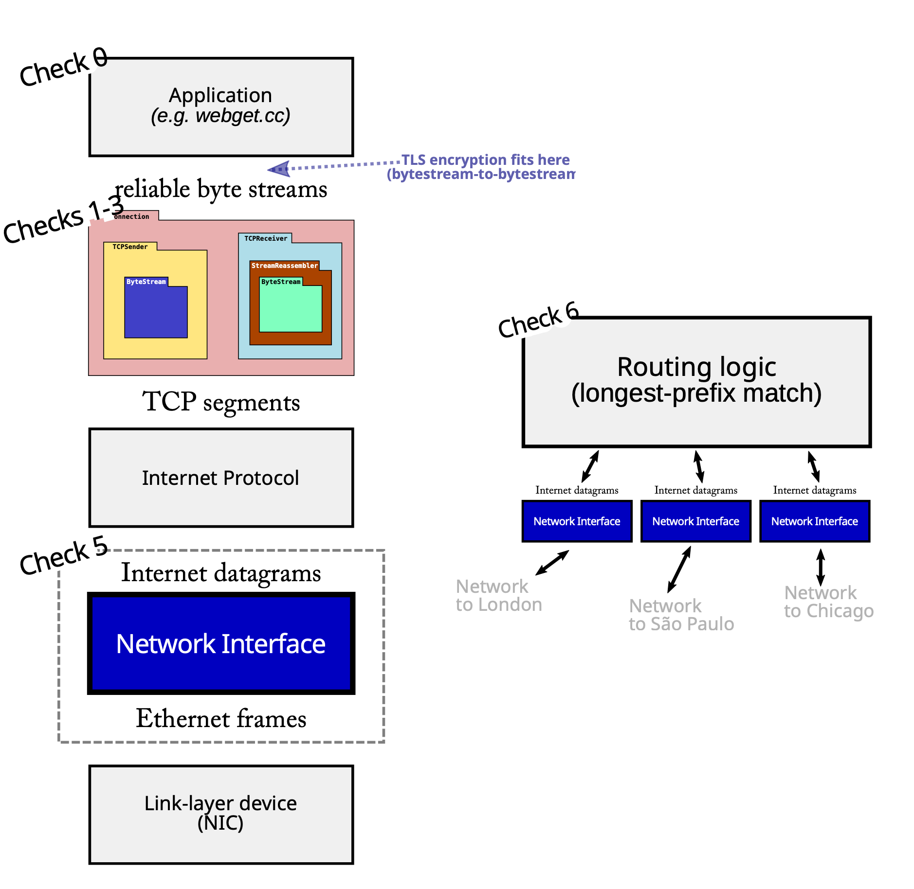

**English:**
CS144: Introduction to Computer Networking
Winter 2025
Lab Checkpoint 5: down the stack (the network interface)
Due: Sunday, Feb. 23, 11:59 p.m.

**中文:**
CS144: 计算机网络导论
2025 年冬季
实验检查点 5：深入协议栈（网络接口）
截止日期：周日，2 月 23 日，晚上 11:59

---

**English:**
Collaboration Policy: Same as checkpoint 0. Please do not look at other students' code or solutions to past versions of these assignments. Please fully disclose any collaborators or any gray areas in your writeup—disclosure is the best policy.

**中文:**
合作政策：与检查点 0 相同。请不要查看其他学生的代码或这些作业过去版本的解决方案。请在你的报告中完全披露任何合作者或任何灰色地带——披露是最好的策略。

---

### **English:** 0 Overview
### **中文:** 0 概述

---

**English:**
In this week's checkpoint, you'll go down the stack and implement a network interface: the bridge between Internet datagrams that travel the world, and link-layer Ethernet frames that travel one hop. This component can fit "underneath” your TCP/IP implementation from the earlier labs, but it will also be used in a different setting: when you build a router in checkpoint 6, it will route datagrams between network interfaces. Figure 1 shows how the network interface fits into both settings.

**中文:**
在本周的检查点中，你将深入协议栈并实现一个网络接口：这是在跨越世界的互联网数据报和单跳传输的链路层以太网帧之间的桥梁。这个组件可以置于你之前实验中 TCP/IP 实现的“下方”，但它也将被用于一个不同的场景：在检查点 6 中构建路由器时，它将在网络接口之间路由数据报。图 1 展示了网络接口如何适应这两种设置。

---

**English:**
In past labs, you wrote a TCP implementation that can exchange TCP segments with any other computer that speaks TCP. How are these segments actually conveyed to the peer's TCP implementation? As we've discussed, there are a few options:
*   TCP-in-UDP-in-IP. The TCP segments can be carried in the payload of a user datagram. When working in a normal (user-space) setting, this is the easiest to implement: Linux provides an interface (a “datagram socket", `UDPSocket`) that lets applications supply *only the payload* of a user datagram and the target address, and the kernel takes care of constructing the UDP header, IP header, and Ethernet header, then sending the packet to the appropriate next hop. The kernel makes sure that each socket has an exclusive combination of local and remote addresses and port numbers, and since the kernel is the one writing these into the UDP and IP headers, it can guarantee isolation between different applications.
*   TCP-in-IP. In common usage, TCP segments are almost always placed directly inside an Internet datagram, without a UDP header between the IP and TCP headers. This is what people mean by "TCP/IP." This is a little more difficult to implement. Linux provides an interface, called a TUN device, that lets application supply an *entire* Internet datagram, and the kernel takes care of the rest (writing the Ethernet header, and actually sending via the physical Ethernet card, etc.). But now the application has to construct the full IP header itself, not just the payload.
*   TCP-in-IP-in-Ethernet. In the above approach, we're still relying on the Linux kernel for part of the networking stack. Each time your code writes an IP datagram to the TUN device, Linux has to construct an appropriate link-layer (Ethernet) frame with the IP datagram as its payload. This means Linux has to figure out the next hop's Ethernet destination address, given the IP address of the next hop. If it doesn't know this mapping already, Linux broadcasts a query that asks, “Who claims the following IP address? What's your Ethernet address?” and waits for a response.

**中文:**
在过去的实验中，你编写了一个 TCP 实现，可以与任何其他讲 TCP 的计算机交换 TCP 段。这些段实际上是如何传送到对等方的 TCP 实现的呢？正如我们所讨论的，有几种选择：

*   **TCP-in-UDP-in-IP**。TCP 段可以被承载在用户数据报的有效载荷中。在正常（用户空间）环境下，这是最容易实现的：Linux 提供一个接口（一个“数据报套接字”，`UDPSocket`），让应用程序*只提供*用户数据报的有效载荷和目标地址，而内核则负责构建 UDP 头部、IP 头部和以太网头部，然后将数据包发送到适当的下一跳。内核确保每个套接字都有一个独占的本地和远程地址及端口号组合，并且由于是内核将这些写入 UDP 和 IP 头部，它可以保证不同应用程序之间的隔离。
*   **TCP-in-IP**。在通常用法中，TCP 段几乎总是直接放在互联网数据报内部，IP 和 TCP 头部之间没有 UDP 头部。这就是人们所说的“TCP/IP”。这实现起来稍微困难一些。Linux 提供一个名为 TUN 设备的接口，让应用程序提供一个*完整*的互联网数据报，内核则负责其余部分（写入以太网头部，并通过物理以太网卡实际发送等）。但现在应用程序必须自己构建完整的 IP 头部，而不仅仅是有效载荷。
*   **TCP-in-IP-in-Ethernet**。在上述方法中，我们仍然依赖 Linux 内核来完成部分网络协议栈的工作。每次你的代码向 TUN 设备写入一个 IP 数据报时，Linux 都必须构建一个合适的链路层（以太网）帧，并将该 IP 数据报作为其有效载荷。这意味着 Linux 必须根据下一跳的 IP 地址找出下一跳的以太网目标地址。如果它还不知道这个映射，Linux 会广播一个查询，询问“谁声明拥有以下 IP 地址？你的以太网地址是什么？”并等待响应。

---

**(Image and Figure 1 Caption)**
**English:**

Figure 1: The network interface bridges the worlds of Internet datagrams and of link-layer frames. This component is useful as part of a host's TCP/IP stack (left side), and also as part of an IP router (right side).

**(图片及图 1 标题)**
**中文:**
图 1：网络接口连接了互联网数据报和链路层帧的世界。该组件既可作为主机 TCP/IP 协议栈的一部分（左侧），也可作为 IP 路由器的一部分（右侧）。

---

**English:**
These functions are performed by the *network interface*: a component that translates outbound IP datagrams into link-layer (e.g., Ethernet) frames and vice versa. (In a real system, network interfaces typically have names like `eth0`, `eth1`, `wlan0`, etc.) In this week's lab, you'll implement a network interface, and stick it at the very bottom of your TCP/IP stack. Your code will produce raw Ethernet frames, which will be handed over to Linux through an interface called a TAP device—similar to a TUN device, but more low-level, in that it exchanges raw link-layer frames instead of IP datagrams.
Most of the work will be in looking up (and caching) the Ethernet address for each next-hop IP address. The protocol for this is called the Address Resolution Protocol, or ARP.
We've given you unit tests that put your network interface through its paces. In checkpoint 6, you'll use the same network interface outside the context of TCP, as a part of an IP router.

**中文:**
这些功能由*网络接口*执行：一个将出站 IP 数据报转换为链路层（例如，以太网）帧，反之亦然的组件。（在真实系统中，网络接口通常有像 `eth0`、`eth1`、`wlan0` 等名称。）在本周的实验中，你将实现一个网络接口，并将其置于你的 TCP/IP 协议栈的最底层。你的代码将生成原始的以太网帧，这些帧将通过一个名为 TAP 设备的接口交给 Linux——它类似于 TUN 设备，但更底层，因为它交换的是原始链路层帧而不是 IP 数据报。
大部分工作将是查找（并缓存）每个下一跳 IP 地址对应的以太网地址。用于此目的的协议称为**地址解析协议（Address Resolution Protocol）**，或 **ARP**。
我们为你提供了单元测试，可以对你的网络接口进行全面测试。在检查点 6 中，你将在 TCP 上下文之外，作为 IP 路由器的一部分，使用相同的网络接口。

---

### **English:** 1 Getting started
### **中文:** 1 开始

---

**English:**
1. Make sure you have committed all your solutions. Please don't modify any files outside the top level of the `src` directory, or `webget.cc`. You may have trouble merging the Checkpoint 5 starter code otherwise.
2. While inside the repository for the lab assignments, run `git fetch --all` to retrieve the most recent version of the lab assignment.
3. Download the starter code for Checkpoint 5 by running `git merge origin/check5-startercode` (If you have renamed the "origin" remote to be something else, you might need to use a different name here, e.g. `git merge upstream/check5-startercode`.)
4. Make sure your build system is properly set up: `cmake -S . -B build`
5. Compile the source code: `cmake --build build`
6. Open and start editing the `writeups/check5.md` file. This is the template for your lab writeup and will be included in your submission.
7. Reminder: please make frequent small commits in your local Git repository as you work. If you need help to make sure you're doing this right, please ask a classmate or the teaching staff for help. You can use the `git log` command to see your Git history.

**中文:**
1.  确保你已经提交了所有的解决方案。请不要修改 `src` 顶级目录或 `webget.cc` 之外的任何文件。否则，在合并检查点 5 的起始代码时可能会遇到麻烦。
2.  在实验作业的仓库内，运行 `git fetch --all` 来获取实验作业的最新版本。
3.  通过运行 `git merge origin/check5-startercode` 来下载检查点 5 的起始代码。（如果你已将“origin”远程重命名为其他名称，你可能需要在此处使用不同的名称，例如 `git merge upstream/check5-startercode`。）
4.  确保你的构建系统已正确设置：`cmake -S . -B build`
5.  编译源代码：`cmake --build build`
6.  打开并开始编辑 `writeups/check5.md` 文件。这是你实验报告的模板，并将包含在你的提交中。
7.  **提醒**：请在你工作时，在你的本地 Git 仓库中进行频繁的小提交。如果你需要帮助以确保你做得正确，请询问同学或教学人员。你可以使用 `git log` 命令查看你的 Git 历史。

---

### **English:** 2 Checkpoint 5: The Address Resolution Protocol
### **中文:** 2 检查点 5：地址解析协议

---

**English:**
Your main task in this lab will be to implement the three main methods of `NetworkInterface` (in the `network_interface.cc` file), maintaining a mapping from IP addresses to Ethernet addresses. The mapping is a cache, or “soft state”: the `NetworkInterface` keeps it around for efficiency's sake, but if it has to restart from scratch, the mapping will naturally be regenerated without causing a problem.

**中文:**
你在本实验中的主要任务是实现 `NetworkInterface` 的三个主要方法（在 `network_interface.cc` 文件中），维护一个从 IP 地址到以太网地址的映射。该映射是一个缓存，或称“软状态”：`NetworkInterface` 为了效率而保留它，但如果必须从头开始，该映射会自然地重新生成而不会引起问题。

---

**English:**
1.  `void NetworkInterface::send_datagram(const InternetDatagram &dgram, const Address &next_hop);`
    This method is called when the caller (e.g., your TCPConnection or a router) wants to send an outbound Internet (IP) datagram to the next hop.¹ It's your interface's job to translate this datagram into an Ethernet frame and (eventually) send it.
    *   If the destination Ethernet address is already known, send it right away. Create an Ethernet frame (with `type` = `EthernetHeader::TYPE_IPv4`), set the payload to be the serialized datagram, and set the source and destination addresses.
    *   If the destination Ethernet address is unknown, broadcast an ARP request for the next hop's Ethernet address, and queue the IP datagram so it can be sent after the ARP reply is received.
    **Except:** You don't want to flood the network with ARP requests. If the network interface already sent an ARP request about the same IP address in the last five seconds, don't send a second request—just wait for a reply to the first one. Again, queue the datagram until you learn the destination Ethernet address.
2.  `void NetworkInterface::recv_frame(const EthernetFrame &frame);`
    This method is called when an Ethernet frame arrives from the network. The code should ignore any frames not destined for the network interface (meaning, the Ethernet destination is either the broadcast address or the interface's own Ethernet address stored in the `_ethernet_address` member variable).
    *   If the inbound frame is IPv4, parse the payload as an `InternetDatagram` and, if successful (meaning the `parse()` method returned `ParseResult::NoError`), push the resulting datagram on to the `_datagrams_received` queue.
    *   If the inbound frame is ARP, parse the payload as an `ARPMessage` and, if successful, remember the mapping between the sender's IP address and Ethernet address for 30 seconds. (Learn mappings from both requests and replies.) In addition, if it's an ARP request asking for our IP address, send an appropriate ARP reply.
3.  `void NetworkInterface::tick(const size_t ms_since_last_tick);`
    This is called as time passes. Expire any IP-to-Ethernet mappings that have expired.

**中文:**
1.  `void NetworkInterface::send_datagram(const InternetDatagram &dgram, const Address &next_hop);`
    当调用者（例如，你的 `TCPConnection` 或路由器）想要向下一跳发送一个出站的互联网（IP）数据报时，会调用此方法。¹你的接口的工作是将此数据报转换为一个以太网帧并（最终）发送它。
    *   如果目标以太网地址已知，立即发送。创建一个以太网帧（`type` = `EthernetHeader::TYPE_IPv4`），将有效载荷设置为序列化的数据报，并设置源和目标地址。
    *   如果目标以太网地址未知，广播一个针对下一跳以太网地址的 ARP 请求，并将 IP 数据报排队，以便在收到 ARP 回复后发送。
    **例外**：你不想用 ARP 请求淹没网络。如果网络接口在过去五秒内已经发送了关于同一 IP 地址的 ARP 请求，不要发送第二个请求——只需等待第一个请求的回复。同样，将数据报排队，直到你获知目标以太网地址。
2.  `void NetworkInterface::recv_frame(const EthernetFrame &frame);`
    当一个以太网帧从网络到达时，会调用此方法。代码应忽略任何不是发往该网络接口的帧（即，以太网目标地址既不是广播地址，也不是存储在 `_ethernet_address` 成员变量中的接口自身以太网地址）。
    *   如果入站帧是 IPv4，将有效载荷解析为 `InternetDatagram`，如果成功（意味着 `parse()` 方法返回 `ParseResult::NoError`），则将生成的数据报推入 `_datagrams_received` 队列。
    *   如果入站帧是 ARP，将有效载荷解析为 `ARPMessage`，如果成功，则记住发送方的 IP 地址和以太网地址之间的映射，有效期为 30 秒。（从请求和回复中都要学习映射。）此外，如果它是一个询问我们 IP 地址的 ARP 请求，发送一个适当的 ARP 回复。
3.  `void NetworkInterface::tick(const size_t ms_since_last_tick);`
    随着时间的推移调用此方法。使任何已过期的 IP 到以太网的映射失效。

---

**English:**
You can test your implementation by running `cmake --build build --target check5`
This test does not rely on your TCP implementation.
¹Please don't confuse the *ultimate* destination of the datagram, which is in the datagram's own header as the destination address, with the *next hop*. In this lab you're *only* going to care about the next hop's address.

**中文:**
你可以通过运行 `cmake --build build --target check5` 来测试你的实现。
此测试不依赖于你的 TCP 实现。
¹请不要将数据报的*最终*目的地（它在数据报自己的头部中作为目标地址）与*下一跳*混淆。在本实验中，你*只*需要关心下一跳的地址。

---

### **English:** 3 Q & A
### **中文:** 3 问与答

---

**English:**
*   How much code are you expecting?
    Overall, we expect the implementation (in `network_interface.cc`) will require about 100-150 lines of code in total.
*   How do I "send“ an Ethernet frame?
    Call `transmit()` on it.
*   What data structure should I use to record the mapping between next-hop IP address and Ethernet addresses?
    Up to you!
*   How do I convert an IP address that comes in the form of an Address object, into a raw 32-bit integer that I can write into the ARP message?
    Use the `Address::ipv4_numeric()` method.
*   What should I do if the NetworkInterface sends an ARP request but never gets a reply? Should I resend it after some timeout? Signal an error to the original sender using ICMP?
    In real life, yes, both of those things, but don't worry about that in this lab. (In real life, an interface will eventually send an ICMP “host unreachable” back across the Internet to the original sender if it can't get a reply to its ARP requests.)
*   What should I do if an InternetDatagram is queued waiting to learn the Ethernet address of the next hop, and that information never comes? Should I drop the datagram after some timeout?
    Again, definitely a “yes” in real life, but don't worry about that in this lab.
*   Where can I read if there are more FAQs after this PDF comes out?
    Please check the website (https://cs144.github.io/lab_faq.html) and EdStem regularly.

**中文:**
*   你们期望多少代码量？
    总的来说，我们预计（在 `network_interface.cc` 中）的实现总共需要大约 100-150 行代码。
*   我如何“发送”一个以太网帧？
    对其调用 `transmit()`。
*   我应该使用什么数据结构来记录下一跳 IP 地址和以太网地址之间的映射？
    由你决定！
*   我如何将一个以 `Address` 对象形式出现的 IP 地址转换为一个可以写入 ARP 消息的原始 32 位整数？
    使用 `Address::ipv4_numeric()` 方法。
*   如果 `NetworkInterface` 发送了一个 ARP 请求但从未收到回复，我该怎么办？我应该在某个超时后重发它吗？使用 ICMP 向原始发送方发出错误信号吗？
    在现实生活中，是的，这两件事都会做，但在本实验中不必担心。（在现实生活中，如果接口无法获得其 ARP 请求的回复，它最终会向原始发送方发送一个 ICMP“主机不可达”消息。）
*   如果一个 `InternetDatagram` 在排队等待学习下一跳的以太网地址，而该信息永远不会到来，我该怎么办？我应该在某个超时后丢弃该数据报吗？
    同样，在现实生活中绝对是“是”，但在本实验中不必担心。
*   在这份 PDF 发布后，如果还有更多的常见问题解答，我可以在哪里阅读？
    请定期查看网站 (https://cs144.github.io/lab_faq.html) 和 EdStem。

---

### **English:** 4 Development and debugging advice
### **中文:** 4 开发和调试建议

---

**English:**
1. Implement the NetworkInterface's public interface (and any private methods or functions you'd like) in the file `network_interface.cc`. You may add any private members you like to the `NetworkInterface` class in `network_interface.hh`.
2. You can test your code with `cmake --build build --target check5`
3. Please re-read the section on “using Git" in the Checkpoint 0 document, and remember to keep the code in the Git repository it was distributed in on the main branch. Make small commits, using good commit messages that identify what changed and why.
4. Please work to make your code readable to the CA who will be grading it for style. Use reasonable and clear naming conventions for variables. Use comments to explain complex or subtle pieces of code. Use “defensive programming”—explicitly check preconditions of functions or invariants, and throw an exception if anything is ever wrong. Use modularity in your design—identify common abstractions and behaviors and factor them out when possible. Blocks of repeated code and enormous functions will make it hard to follow your code.

**中文:**
1.  在 `network_interface.cc` 文件中实现 `NetworkInterface` 的公共接口（以及你喜欢的任何私有方法或函数）。你可以在 `network_interface.hh` 中的 `NetworkInterface` 类中添加任何你喜欢的私有成员。
2.  你可以用 `cmake --build build --target check5` 来测试你的代码。
3.  请重读检查点 0 文档中关于“使用 Git”的部分，并记住将代码保存在其分发时所在的主分支的 Git 仓库中。进行小的提交，并使用能够说明更改内容和原因的良好提交信息。
4.  请努力使你的代码对于将要对其进行风格评分的助教（CA）来说是可读的。为变量使用合理且清晰的命名约定。使用注释来解释复杂或微妙的代码片段。使用“防御性编程”——明确检查函数或不变量的前提条件，如果出现任何错误就抛出异常。在你的设计中使用模块化——识别共同的抽象和行为，并在可能时将它们提取出来。重复的代码块和庞大的函数将使你的代码难以理解。

---

### **English:** 5 Submit
### **中文:** 5 提交

---

**English:**
1. In your submission, please only make changes to the `.hh` and `.cc` files in the `src` directory. Within these files, please feel free to add private members as necessary, but please don't change the `public` interface of any of the classes.
2. Before handing in any assignment, please run these in order:
   (a) Make sure you have committed all of your changes to the Git repository. You can run `git status` to make sure there are no outstanding changes. Remember: make small commits as you code.
   (b) `cmake --build build --target format` (to normalize the coding style)
   (c) `cmake --build build --target check5` (to make sure the automated tests pass)
   (d) Optional: `cmake --build build --target tidy` (suggests improvements to follow good C++ programming practices)
3. Write a report in `writeups/check5.md`. This file should be a roughly 20-to-50-line document with no more than 80 characters per line to make it easier to read. The report should contain the following sections:
   (a) Program Structure and Design. Describe the high-level structure and design choices embodied in your code. You do not need to discuss in detail what you inherited from the starter code. Use this as an opportunity to highlight important design aspects and provide greater detail on those areas for your grading TA to understand. You are strongly encouraged to make this writeup as readable as possible by using subheadings and outlines. Please do not simply translate your program into an paragraph of English.
   (b) Implementation Challenges. Describe the parts of code that you found most troublesome and explain why. Reflect on how you overcame those challenges and what helped you finally understand the concept that was giving you trouble. How did you attempt to ensure that your code maintained your assumptions, invariants, and preconditions, and in what ways did you find this easy or difficult? How did you debug and test your code?
   (c) Remaining Bugs. Point out and explain as best you can any bugs (or unhandled edge cases) that remain in the code.
4. Please also fill in the number of hours the assignment took you and any other comments.
5. Please let the course staff know ASAP of any problems at a lab session, or by posting a question on Ed. Good luck!

**中文:**
1.  在你的提交中，请仅对 `src` 目录中的 `.hh` 和 `.cc` 文件进行更改。在这些文件中，你可以根据需要随意添加私有成员，但请不要更改任何类的 `public` 接口。
2.  在提交任何作业之前，请按以下顺序运行这些命令：
    (a) 确保你已经将所有更改提交到 Git 仓库。你可以运行 `git status` 来确保没有未完成的更改。记住：在你编码时进行小的提交。
    (b) `cmake --build build --target format` （以规范化编码风格）
    (c) `cmake --build build --target check5` （以确保自动化测试通过）
    (d) 可选：`cmake --build build --target tidy` （建议改进以遵循良好的 C++ 编程实践）
3.  在 `writeups/check5.md` 中撰写一份报告。这个文件应该是一个大约 20 到 50 行的文档，每行不超过 80 个字符，以便于阅读。报告应包含以下部分：
    (a) **程序结构与设计**。描述你代码中体现的高层结构和设计选择。你不需要详细讨论你从起始代码继承了什么。以此为契机，突出重要的设计方面，并为你的评分助教提供更详细的信息以理解这些领域。强烈建议你通过使用副标题和提纲来使这份报告尽可能可读。请不要简单地将你的程序翻译成一段英文。
    (b) **实现挑战**。描述你觉得最棘手的代码部分并解释原因。反思你是如何克服这些挑战的，以及是什么帮助你最终理解了那个让你困扰的概念。你是如何尝试确保你的代码维持你的假设、不变量和前提条件的，以及在哪些方面你觉得这很容易或困难？你是如何调试和测试你的代码的？
    (c) **剩余的 Bug**。尽你所能指出并解释代码中仍然存在的任何 bug（或未处理的边缘情况）。
4.  也请填写完成此作业所花费的小时数以及任何其他评论。
5.  如果在实验课上遇到任何问题，请尽快告知课程工作人员，或在 Ed 上发帖提问。祝你好运！