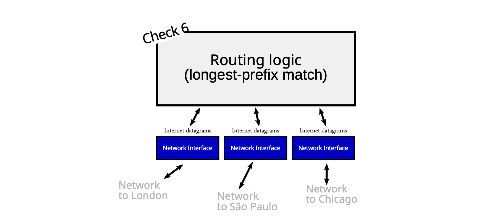
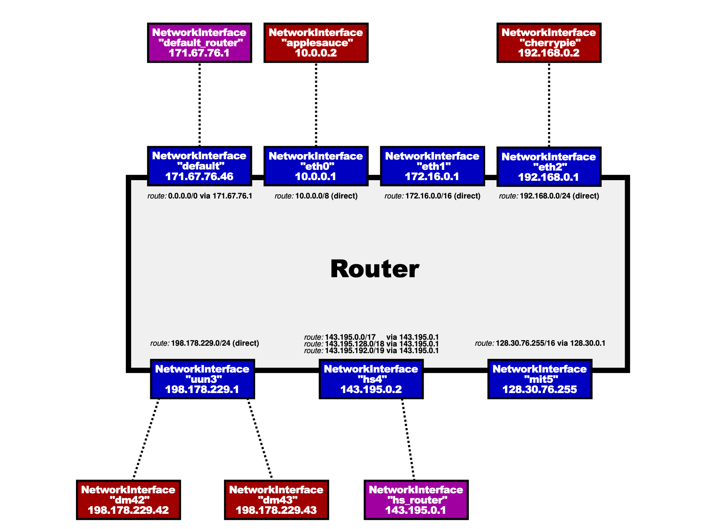

**English:**
CS144: Introduction to Computer Networking
Lab Checkpoint 6: building an IP router
Due: Sunday, March 2, 11:59 p.m.
Winter 2025

**中文:**
CS144: 计算机网络导论
实验检查点 6：构建一个 IP 路由器
截止日期：周日，3 月 2 日，晚上 11:59
2025 年冬季

---

**English:**
0 Collaboration Policy
Collaboration Policy: Same as checkpoint 0. Please do not look at other students' code or solutions to past versions of these assignments. Please fully disclose any collaborators or any gray areas in your writeup—disclosure is the best policy.

**中文:**
0 合作政策
合作政策：与检查点 0 相同。请不要查看其他学生的代码或这些作业过去版本的解决方案。请在你的报告中完全披露任何合作者或任何灰色地带——披露是最好的策略。

---

### **English:** 1 Overview
### **中文:** 1 概述

---

**English:**
In this week's lab checkpoint, you'll implement an IP router on top of your existing `NetworkInterface`. A router has *several* network interfaces, and can receive Internet datagrams on any of them. The router's job is to forward the datagrams it gets according to the **routing table**: a list of rules that tells the router, for any given datagram,
*   What interface to send it out
*   The IP address of the next hop

**中文:**
在本周的实验检查点中，你将在你现有的 `NetworkInterface` 之上实现一个 IP 路由器。一个路由器有*多个*网络接口，并且可以在其中任何一个接口上接收互联网数据报。路由器的任务是根据**路由表**来转发它收到的数据报：路由表是一个规则列表，它告诉路由器，对于任何给定的数据报，
*   应该从哪个接口发送出去
*   下一跳的 IP 地址是什么

---

**English:**
Your job is to implement a router that can figure out these two things for any given datagram. (You will not need to implement the algorithms that *make* the routing table, e.g. RIP, OSPF, BGP, or an SDN controller—just the algorithm that *follows* the routing table.)

**中文:**
你的任务是实现一个能够为任何给定的数据报找出这两件事的路由器。（你将不需要实现*制定*路由表的算法，例如 RIP、OSPF、BGP 或 SDN 控制器——只需要实现*遵循*路由表的算法。）

---

**English:**
Your implementation of the router will use the Minnow library with a new `Router` class, and tests that will check your router's functionality in a simulated network. Checkpoint 6 builds on your implementation of `NetworkInterface` from Checkpoint 5, but does *not* use the TCP stack you implemented previously. IP routers don't have to know anything about TCP, ARP, or Ethernet (only IP). We expect your implementation will require about **30–60 lines of code**. (The `scripts/lines-of-code` tool prints “Router: 38 lines of code” from the starter code, and "89 lines of code" for our example solutions.)

**中文:**
你的路由器实现将使用 Minnow 库，其中包含一个新的 `Router` 类，以及将在一个模拟网络中检查你的路由器功能的测试。检查点 6 建立在你在检查点 5 中实现的 `NetworkInterface` 的基础上，但*不*使用你之前实现的 TCP 协议栈。IP 路由器不需要了解任何关于 TCP、ARP 或以太网的信息（只需要 IP）。我们预计你的实现将需要大约 **30–60 行代码**。（`scripts/lines-of-code` 工具从起始代码打印出“Router: 38 lines of code”，对于我们的示例解决方案则打印出“89 lines of code”。）

---

### **English:** 2 Getting started
### **中文:** 2 开始

---

**English:**
1. Make sure you have committed all your solutions to Checkpoint 5. Please don't modify any files outside the top level of the `src` directory, or `webget.cc`. You may have trouble merging the Checkpoint 6 starter code otherwise.
2. While inside the repository for the lab assignments, run `git fetch --all` to retrieve the most recent version of the lab assignment.
3. Download the starter code for Checkpoint 6 by running `git merge origin/check6-startercode` (If you have renamed the "origin" remote to be something else, you might need to use a different name here, e.g. `git merge upstream/check5-startercode`)
4. Make sure your build system is properly set up: `cmake -S . -B build`
5. Compile the source code: `cmake --build build`
6. Open and start editing the `writeups/check6.md` file. This is the template for your lab writeup and will be included in your submission.
7. Reminder: please make frequent small commits in your local Git repository as you work. If you need help to make sure you're doing this right, please ask a classmate or the teaching staff for help. You can use the `git log` command to see your Git history.

**中文:**
1.  确保你已经提交了检查点 5 的所有解决方案。请不要修改 `src` 顶级目录之外的任何文件，或 `webget.cc`。否则，在合并检查点 6 的起始代码时可能会遇到麻烦。
2.  在实验作业的仓库内，运行 `git fetch --all` 来获取实验作业的最新版本。
3.  通过运行 `git merge origin/check6-startercode` 来下载检查点 6 的起始代码。（如果你已将“origin”远程重命名为其他名称，你可能需要在此处使用不同的名称，例如 `git merge upstream/check5-startercode`。）
4.  确保你的构建系统已正确设置：`cmake -S . -B build`
5.  编译源代码：`cmake --build build`
6.  打开并开始编辑 `writeups/check6.md` 文件。这是你实验报告的模板，并将包含在你的提交中。
7.  **提醒**：请在你工作时，在你的本地 Git 仓库中进行频繁的小提交。如果你需要帮助以确保你做得正确，请询问同学或教学人员。你可以使用 `git log` 命令查看你的 Git 历史。

---

**(Image and Figure 1 Caption)**
**English:**

Figure 1: A router contains several network interfaces and can receive IP datagrams on any one of them. The router forwards any datagram it receives to the next hop, on the appropriate outbound interface. The routing table tells the router how to make this decision.

**(图片及图 1 标题)**
**中文:**
图 1：一个路由器包含多个网络接口，并可以在其中任何一个接口上接收 IP 数据报。路由器将其接收到的任何数据报转发到下一跳，通过适当的出站接口。路由表告诉路由器如何做出这个决定。

---

### **English:** 3 Implementing the Router
### **中文:** 3 实现路由器

---

**English:**
In this lab, you will implement a `Router` class that can:
*   keep track of a routing table (the list of forwarding rules, or routes), and
*   forward each datagram it receives:
    *   to the correct next hop
    *   on the correct outgoing `NetworkInterface`.

**中文:**
在本实验中，你将实现一个 `Router` 类，该类能够：
*   维护一个路由表（转发规则或路由的列表），并且
*   转发它接收到的每个数据报：
    *   到正确的下一跳
    *   在正确的出站 `NetworkInterface` 上。

---

**English:**
Your implementation will be added to the `router.hh` and `router.cc` skeleton files. Before you get to coding, please review the documentation for the new `Router` class in `router.hh`.
Here are the two methods you'll implement, and what we're expecting in each:

**中文:**
你的实现将被添加到 `router.hh` 和 `router.cc` 的骨架文件中。在开始编码之前，请查看 `router.hh` 中新 `Router` 类的文档。
以下是你将要实现的两个方法，以及我们对每个方法的期望：

---

**English:**
`void add_route(uint32_t route_prefix, uint8_t prefix_length, optional<Address> next_hop, size_t interface_num);`
This method adds a route to the routing table. You'll want to add a data structure as a private member in the `Router` class to store this information. All this method needs to do is save the route for later use.

**中文:**
`void add_route(uint32_t route_prefix, uint8_t prefix_length, optional<Address> next_hop, size_t interface_num);`
此方法向路由表添加一条路由。你需要在 `Router` 类中添加一个数据结构作为私有成员来存储此信息。此方法需要做的所有事情就是保存该路由以备后用。

---

**English:**
(Boxed text)
**What do the parts of a route mean?**
A route is a “match-action” rule: it tells the router that *if* a datagram is headed for a particular network (a range of IP addresses), and *if* the route is chosen as the most specific matching route, *then* the router should forward the datagram to a particular next hop on a particular interface.
The **“match”**: is the datagram headed for this network? The `route_prefix` and `prefix_length` together specify a range of IP addresses (a network) that might include the datagram's destination. The `route_prefix` is a 32-bit numeric IP address. The `prefix_length` is a number between 0 and 32 (inclusive); it tells the router how many *most-significant bits* of the `route_prefix` are significant. For example, to express a route to the network “18.47.0.0/16" (this matches any 32-bit IP address where the first two bytes are 18 and 47), the `route_prefix` would be 305070080 (18 × 2²⁴ + 47 × 2¹⁶), and the `prefix_length` would be 16. Any datagram destined for “18.47.x.y” will match.
The **"action"**: what to do if the route matches and is chosen. If the router is directly attached to the network in question, the `next_hop` will be an empty `optional`. In that case, the `next_hop` is the datagram's destination address. But if the router is connected to the network in question through some other router, the `next_hop` will contain the IP address of the next router along the path. The `interface_num` gives the index of the router's `NetworkInterface` that should use to send the datagram to the next hop. You can access this interface with the `interface(interface_num)` method.

**中文:**
（框内文字）
**一条路由的各个部分是什么意思？**
一条路由是一个“匹配-动作”规则：它告诉路由器，*如果*一个数据报的目的地是某个特定的网络（一个 IP 地址范围），并且*如果*该路由被选为最具体的匹配路由，*那么*路由器应该将该数据报转发到特定接口上的特定下一跳。
**“匹配”**：数据报的目的地是这个网络吗？`route_prefix` 和 `prefix_length` 共同指定了一个可能包含数据报目的地的 IP 地址范围（一个网络）。`route_prefix` 是一个 32 位的数字 IP 地址。`prefix_length` 是一个介于 0 和 32（含）之间的数字；它告诉路由器 `route_prefix` 的多少个*最高有效位*是重要的。例如，要表示一条到网络“18.47.0.0/16”的路由（这匹配任何前两个字节是 18 和 47 的 32 位 IP 地址），`route_prefix` 将是 305070080 (18 × 2²⁴ + 47 × 2¹⁶)，而 `prefix_length` 将是 16。任何目的地为“18.47.x.y”的数据报都将匹配。
**“动作”**：如果路由匹配并被选中，该怎么办。如果路由器直接连接到所述网络，`next_hop` 将是一个空的 `optional`。在这种情况下，`next_hop` 就是数据报的目的地址。但如果路由器通过某个其他路由器连接到所述网络，`next_hop` 将包含路径上下一台路由器的 IP 地址。`interface_num` 给出路由器应该用来向下一跳发送数据报的 `NetworkInterface` 的索引。你可以使用 `interface(interface_num)` 方法访问此接口。

---

**English:**
`void route();`
Here's where the rubber meets the road. This method needs to route each incoming datagram to the next hop, out the appropriate interface. It needs to implement the “longest-prefix match" logic of an IP router to find the *best* route to follow. That means:
*   The `Router` searches the routing table to find the routes that match the datagram's destination address. By “match,” we mean the most-significant `prefix_length` bits of the destination address are identical to the most-significant `prefix_length` bits of the `route_prefix`.
*   Among the matching routes, the router chooses the route with the *biggest* value of `prefix_length`. This is the **longest-prefix-match route**.
*   If no routes matched, the router drops the datagram.
*   The router decrements the datagram's TTL (time to live). If the TTL was zero already, or hits zero after the decrement, the router should drop the datagram.
*   Otherwise, the router sends the modified datagram on the appropriate interface (`interface(interface_num)->send_datagram()`) to the appropriate next hop.

**中文:**
`void route();`
这里是关键所在。此方法需要将每个传入的数据报路由到下一跳，通过适当的接口发送出去。它需要实现 IP 路由器的“最长前缀匹配”逻辑，以找到要遵循的*最佳*路由。这意味着：
*   `Router` 搜索路由表，以找到与数据报目的地址匹配的路由。我们所说的“匹配”，是指目的地址的最高有效 `prefix_length` 位与 `route_prefix` 的最高有效 `prefix_length` 位相同。
*   在匹配的路由中，路由器选择 `prefix_length` 值*最大*的路由。这就是**最长前缀匹配路由**。
*   如果没有路由匹配，路由器将丢弃该数据报。
*   路由器将数据报的 TTL（生存时间）减一。如果 TTL 已经为零，或者在递减后达到零，路由器应丢弃该数据报。
*   否则，路由器将修改后的数据报在适当的接口上（`interface(interface_num)->send_datagram()`）发送到适当的下一跳。

---

**English:**
(Boxed text)
There's a beauty (or at least a successful abstraction) in the Internet's design here: the router never thinks about TCP, about ARP, or about Ethernet frames. The router doesn't even know what the link layer looks like. The router only thinks about Internet datagrams, and only interacts with the link layer through the `NetworkInterface` abstraction. When it comes to questions like, “How are link-layer addresses resolved?” or "Does the link layer even have its own addressing scheme distinct from IP?” or “What's the format of the link-layer frames?” or “What's the meaning of the datagram's payload?", the router just doesn't care.

**中文:**
（框内文字）
这里体现了互联网设计的美妙之处（或者至少是一个成功的抽象）：路由器从不考虑 TCP、ARP 或以太网帧。路由器甚至不知道链路层是什么样子。路由器只考虑互联网数据报，并且只通过 `NetworkInterface` 抽象与链路层交互。当遇到诸如“链路层地址是如何解析的？”或“链路层是否有自己独立于 IP 的寻址方案？”或“链路层帧的格式是什么？”或“数据报有效载荷的含义是什么？”等问题时，路由器根本不关心。

---

### **English:** 4 Testing
### **中文:** 4 测试

---

**English:**
You can test your implementation by running `cmake --build build --target check5`. This will test your router in a particular simulated network, shown in Figure 2.

**中文:**
你可以通过运行 `cmake --build build --target check5` 来测试你的实现。这将在一个特定的模拟网络中测试你的路由器，如图 2 所示。

---

**(Image and Figure 2 Caption)**
**English:**

Figure 2: The simulated test network used in the router test, also run by `cmake --build build --target check5`. (Fun fact: the UUN network is David Mazières’s slice of the Internet, allocated in 1993. The `whois` tool, or the linked website, can be used to look up who controls each IP address allocation.)

**(图片及图 2 标题)**
**中文:**
图 2：路由器测试中使用的模拟测试网络，也通过 `cmake --build build --target check5` 运行。（趣闻：UUN 网络是 David Mazières 在 1993 年分配到的互联网片段。可以使用 `whois` 工具或链接的网站来查询每个 IP 地址分配的控制者。）

---

### **English:** 5 Q & A
### **中文:** 5 问与答

---

**English:**
*   What data structure should I use to record the routing table?
    Up to you! But please don't get crazy. It's perfectly acceptable for each datagram to require O(N) work, where N is the number of entries in the routing table. If you'd like to do something more efficient, we'd encourage you to get a working implementation first before optimizing, and carefully document and comment whatever you choose to implement.
*   How do I convert an IP address that comes in the form of an `Address` object, into a raw 32-bit integer that I can write into the ARP message?
    Use the `Address::ipv4_numeric()` method.
*   How do I convert an IP address that comes in the form of a raw 32-bit integer into an `Address` object?
    Use the `Address::from_ipv4_numeric()` method.
*   How do I compare the most-significant N bits (where 0 ≤ N ≤ 32) of one 32-bit IP address with the most-significant N bits of another 32-bit IP address?
    This is probably the “trickiest” part of this assignment—getting that logic right. It may be worth writing a small test program in C++ (a short standalone program) or adding a test to Minnow to verify your understanding of the relevant C++ operators and double-check your logic.
    Recall that in C and C++, it can produce *undefined behavior* to shift a 32-bit integer by 32 bits. The tests run your code under sanitizers that try to detect this. You can run the router test directly by running `./build/tests/router` from the minnow directory.
*   If the router has no route to the destination, or if the TTL hits zero, shouldn't it send an ICMP error message back to the datagram's source?
    In real life, yes, that would be helpful. But not necessary in this lab—dropping the datagram is sufficient. (Even in the real world, not every router will send an ICMP message back to the source in these situations.)
*   Where can I read if there are more FAQs after this PDF comes out?
    Please check the website (https://cs144.github.io/lab_faq.html) and EdStem regularly.

**中文:**
*   我应该使用什么数据结构来记录路由表？
    由你决定！但请不要搞得太复杂。对于每个数据报，要求 O(N) 的工作量是完全可以接受的，其中 N 是路由表中的条目数。如果你想做得更高效，我们鼓励你在优化之前先获得一个可工作的实现，并仔细地为你选择实现的任何内容编写文档和注释。
*   我如何将一个以 `Address` 对象形式出现的 IP 地址转换为一个可以写入 ARP 消息的原始 32 位整数？
    使用 `Address::ipv4_numeric()` 方法。
*   我如何将一个原始 32 位整数形式的 IP 地址转换为一个 `Address` 对象？
    使用 `Address::from_ipv4_numeric()` 方法。
*   我如何比较一个 32 位 IP 地址的最高有效 N 位（其中 0 ≤ N ≤ 32）与另一个 32 位 IP 地址的最高有效 N 位？
    这可能是本次作业最“棘手”的部分——把这个逻辑搞对。可能值得用 C++ 写一个小测试程序（一个简短的独立程序）或向 Minnow 添加一个测试，以验证你对相关 C++ 运算符的理解并仔细检查你的逻辑。
    回想一下，在 C 和 C++ 中，将一个 32 位整数移位 32 位会产生*未定义行为*。测试会在试图检测此问题的清理程序下运行你的代码。你可以通过在 minnow 目录下运行 `./build/tests/router` 来直接运行路由器测试。
*   如果路由器没有到目的地的路由，或者如果 TTL 达到零，它不应该向数据报的源发送一个 ICMP 错误消息吗？
    在现实生活中，是的，那将是有帮助的。但在本实验中不是必须的——丢弃数据报就足够了。（即使在现实世界中，也不是每个路由器都会在这些情况下向源发送 ICMP 消息。）
*   在这份 PDF 发布后，如果还有更多的常见问题解答，我可以在哪里阅读？
    请定期查看网站 (https://cs144.github.io/lab_faq.html) 和 EdStem。

---

### **English:** 6 Submit
### **中文:** 6 提交

---

**English:**
1. In your submission, please only make changes to the `.hh` and `.cc` files in the `src` directory. Within these files, please feel free to add private members as necessary, but please don't change the `public` interface of any of the classes.
2. Before handing in any assignment, please run these in order:
   (a) Make sure you have committed all of your changes to the Git repository. You can run `git status` to make sure there are no outstanding changes. Remember: make small commits as you code.
   (b) `cmake --build build --target format` (to normalize the coding style)
   (c) `cmake --build build --target check6` (to make sure the automated tests pass)
   (d) Optional: `cmake --build build --target tidy` (suggests improvements to follow good C++ programming practices)
3. Write a report in `writeups/check6.md`. This file should be a roughly 20-to-50-line document with no more than 80 characters per line to make it easier to read. The report should contain the following sections:
   (a) Program Structure and Design. Describe the high-level structure and design choices embodied in your code. You do not need to discuss in detail what you inherited from the starter code. Use this as an opportunity to highlight important design aspects and provide greater detail on those areas for your grading TA to understand. You are strongly encouraged to make this writeup as readable as possible by using subheadings and outlines. Please do not simply translate your program into an paragraph of English.
   (b) Implementation Challenges. Describe the parts of code that you found most troublesome and explain why. Reflect on how you overcame those challenges and what helped you finally understand the concept that was giving you trouble. How did you attempt to ensure that your code maintained your assumptions, invariants, and preconditions, and in what ways did you find this easy or difficult? How did you debug and test your code?
   (c) Remaining Bugs. Point out and explain as best you can any bugs (or unhandled edge cases) that remain in the code.
4. Please also fill in the number of hours the assignment took you and any other comments.
5. Please let the course staff know ASAP of any problems at the lab sessions, or by posting a question on EdStem.

**中文:**
1.  在你的提交中，请仅对 `src` 目录中的 `.hh` 和 `.cc` 文件进行更改。在这些文件中，你可以根据需要随意添加私有成员，但请不要更改任何类的 `public` 接口。
2.  在提交任何作业之前，请按以下顺序运行这些命令：
    (a) 确保你已经将所有更改提交到 Git 仓库。你可以运行 `git status` 来确保没有未完成的更改。记住：在你编码时进行小的提交。
    (b) `cmake --build build --target format` （以规范化编码风格）
    (c) `cmake --build build --target check6` （以确保自动化测试通过）
    (d) 可选：`cmake --build build --target tidy` （建议改进以遵循良好的 C++ 编程实践）
3.  在 `writeups/check6.md` 中撰写一份报告。这个文件应该是一个大约 20 到 50 行的文档，每行不超过 80 个字符，以便于阅读。报告应包含以下部分：
    (a) **程序结构与设计**。描述你代码中体现的高层结构和设计选择。你不需要详细讨论你从起始代码继承了什么。以此为契机，突出重要的设计方面，并为你的评分助教提供更详细的信息以理解这些领域。强烈建议你通过使用副标题和提纲来使这份报告尽可能可读。请不要简单地将你的程序翻译成一段英文。
    (b) **实现挑战**。描述你觉得最棘手的代码部分并解释原因。反思你是如何克服这些挑战的，以及是什么帮助你最终理解了那个让你困扰的概念。你是如何尝试确保你的代码维持你的假设、不变量和前提条件的，以及在哪些方面你觉得这很容易或困难？你是如何调试和测试你的代码的？
    (c) **剩余的 Bug**。尽你所能指出并解释代码中仍然存在的任何 bug（或未处理的边缘情况）。
4.  也请填写完成此作业所花费的小时数以及任何其他评论。
5.  如果在实验课上遇到任何问题，请尽快告知课程工作人员，或在 EdStem 上发帖提问。