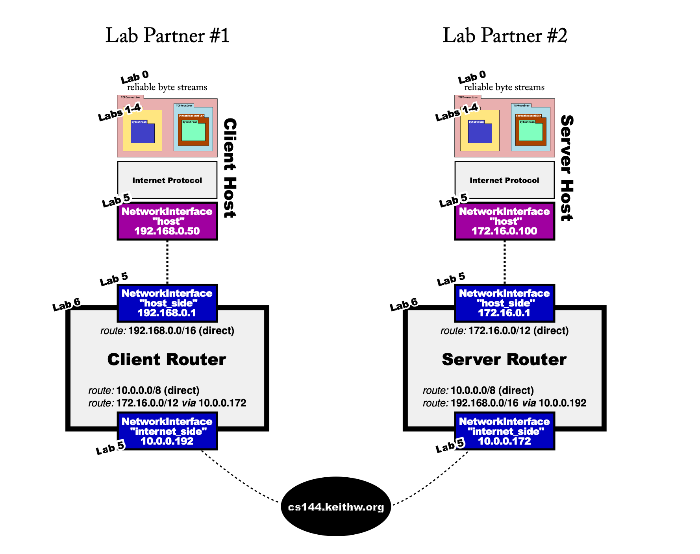

**English:**
CS144: Introduction to Computer Networking
Checkpoint 7: putting it all together
Due: end of class (March 14, 11:59 p.m.)
Winter 2025

**中文:**
CS144: 计算机网络导论
检查点 7：整合所有内容
截止日期：课程结束时（3 月 14 日，晚上 11:59）
2025 年冬季

---

### **English:** 0 Collaboration Policy
### **中文:** 0 合作政策

---

**English:**
Collaboration Policy: Checkpoint 7 asks you to work with a groupmate—you'll need to connect together and perhaps debug together. In general, though, the collaboration rules are the same as checkpoint 0. Please do not look at other students' code or solutions to past versions of these assignments. Please fully disclose any collaborators or any gray areas in your writeup—disclosure is the best policy.

**中文:**
合作政策：检查点 7 要求你与一位组员合作——你们需要连接在一起，可能还需要一起调试。不过，总的来说，合作规则与检查点 0 相同。请不要查看其他学生的代码或这些作业过去版本的解决方案。请在你的报告中完全披露任何合作者或任何灰色地带——披露是最好的策略。

---

### **English:** 1 Overview
### **中文:** 1 概述

---

**English:**
By this point in the class, you've implemented a significant portion of the Internet's infrastructure. From Checkpoint 0 (a reliable byte stream), to Checkpoints 1-3 (the Transmission Control Protocol), Checkpoint 5 (an IP/Ethernet network interface) and Checkpoint 6 (an IP router), you have done a lot of coding!

**中文:**
到课程的这个阶段，你已经实现了互联网基础设施的很大一部分。从检查点 0（一个可靠的字节流），到检查点 1-3（传输控制协议），检查点 5（一个 IP/以太网网络接口）和检查点 6（一个 IP 路由器），你已经编写了大量的代码！

---

**English:**
In this checkpoint, you won't necessarily need to do any coding (assuming your previous checkpoints are in good working shape). Instead, to cap off your accomplishment, you're going to use all of your previous labs to create a real network that includes your network stack (host and router) talking to the network stack implemented by another student in the class.

**中文:**
在这个检查点中，你不一定需要编写任何代码（假设你之前的检查点都工作良好）。相反，为了给你的成就画上句号，你将使用你之前所有的实验来创建一个真实的、包含你的网络协议栈（主机和路由器）与班上另一位同学实现的网络协议栈进行通信的网络。

---

**English:**
This checkpoint is done in pairs. You will need to work with a lab partner (another student in the class). Please use the lab sessions to find lab partners, or EdStem if you cannot attend the lab session. If it's necessary, the same student can serve as “lab partner” more than once.

**中文:**
这个检查点是两人一组完成的。你需要与一位实验伙伴（班上的另一位同学）合作。请利用实验课时间寻找实验伙伴，或者如果你不能参加实验课，可以使用 EdStem。如有必要，同一个学生可以多次担任“实验伙伴”。

---

### **English:** 2 Getting started
### **中文:** 2 开始

---

**English:**
1. Make sure you have committed all your solutions. Please don't modify any files outside the top level of the `src` directory, or `webget.cc` and `ip_raw.cc`. You may have trouble merging the Checkpoint 7 starter code otherwise.
2. While inside the repository for the lab assignments, run `git fetch --all` to retrieve the most recent version of the lab assignment.
3. Download the starter code for Checkpoint 7 by running `git merge origin/check7-startercode`.
4. Make sure your build system is properly set up: `cmake -S . -B build`
5. Remember that if you have trouble, you can build “sanitizing” (bug-checking) versions of the applications with `cmake -S . -B build -DSANITIZED_APPS=True`
6. Compile the source code: `cmake --build build`
7. Open and start editing the `writeups/check7.md` file. This is the template for your lab writeup and will be included in your submission.
8. Reminder: please make frequent small commits in your local Git repository as you work. If you need help to make sure you're doing this right, please ask a classmate or the teaching staff for help. You can use the `git log` command to see your Git history.

**中文:**
1.  确保你已经提交了所有的解决方案。请不要修改 `src` 顶级目录之外的任何文件，或 `webget.cc` 和 `ip_raw.cc`。否则，在合并检查点 7 的起始代码时可能会遇到麻烦。
2.  在实验作业的仓库内，运行 `git fetch --all` 来获取实验作业的最新版本。
3.  通过运行 `git merge origin/check7-startercode` 来下载检查点 7 的起始代码。
4.  确保你的构建系统已正确设置：`cmake -S . -B build`
5.  记住，如果你遇到麻烦，你可以用 `cmake -S . -B build -DSANITIZED_APPS=True` 来构建应用程序的“清理”（错误检查）版本。
6.  编译源代码：`cmake --build build`
7.  打开并开始编辑 `writeups/check7.md` 文件。这是你实验报告的模板，并将包含在你的提交中。
8.  **提醒**：请在你工作时，在你的本地 Git 仓库中进行频繁的小提交。如果你需要帮助以确保你做得正确，请询问同学或教学人员。你可以使用 `git log` 命令查看你的 Git 历史。

---

### **English:** 3 The Network
### **中文:** 3 网络

---

**English:**
In this lab, you'll create a real network that combines your network stack with one implemented by another student in the class. You'll re-do the “1 megabyte challenge” that you did in checkpoint 3, but this time over an entire physical-layer network path (including your router and their router). Each of you will contribute one host (including your reliable Byte Stream, your TCP implementation, and your NetworkInterface) and one router (including two more of your NetworkInterfaces):

**中文:**
在本实验中，你将创建一个真实的、将你的网络协议栈与班上另一位同学实现的协议栈相结合的网络。你将重做你在检查点 3 中完成的“1 兆字节挑战”，但这一次是在一个完整的物理层网络路径上（包括你的路由器和他们的路由器）。你们每人将贡献一台主机（包括你的可靠字节流、你的 TCP 实现和你的网络接口）和一台路由器（包括另外两个你的网络接口）：

---



---

**English:**
Because it's likely that you or your lab partner will be behind a Network Address Translator, the network connection between the two sides will flow through a relay server (cs144.keithw.org).
We have glued your code together in a new application that can be found in `build/apps/endtoend`. Here are the steps to run it:
1. Before doing these steps with a lab partner, try them by yourself. You can play both roles, client and server, by using two different windows or terminals on your VM. This way your network will include two copies of your code (host and router) talking to themselves. This is easier to debug than talking to a stranger!
Once these steps work on your own, then try them with a lab partner. Decide which of the two of you will act as the “client" and who will be the “server”. Once it works, you can always swap the roles and try again.
2. To use the relay, please pick a random even number between 1024 and 64000. This identifies your lab group and needs to be different from any other lab group working at the same time, so please do pick a random number. And it needs to be an even number. For the rest of these examples, we'll assume you picked “3000”. But don't actually use "3000"—it needs to be a different number from everybody else.
3. The "server" student runs: `./build/apps/endtoend server cs144.keithw.org 3000` (replace "3000" with your actual number).
If all goes well, the “server” will print output like this:
```
$ ./build/apps/endtoend server cs144.keithw.org 3000
DEBUG: Network interface has Ethernet address 02:00:00:5e:61:17 and IP address 172.16.0.1
DEBUG: Network interface has Ethernet address 02:00:00:cd:e7:e0 and IP address 10.0.0.172
DEBUG: adding route 172.16.0.0/12 => (direct) on interface 0
DEBUG: adding route 10.0.0.0/8 => (direct) on interface 1
DEBUG: adding route 192.168.0.0/16 => 10.0.0.192 on interface 1
DEBUG: Network interface has Ethernet address 5a:75:4e:8b:20:00 and IP address 172.16.0.100
DEBUG: Listening for incoming connection...
```
4. The "client" student runs: `./build/apps/endtoend client cs144.keithw.org 3001` (replace "3001" with whatever your random number was, plus one).
If all goes well, the “client” will print output like this:
```
$ ./build/apps/endtoend client cs144.keithw.org 3001
DEBUG: Network interface has Ethernet address 02:00:00:41:c7:5b and IP address 192.168.0.1
DEBUG: Network interface has Ethernet address 02:00:00:e6:66:d9 and IP address 10.0.0.192
DEBUG: adding route 192.168.0.0/16 => (direct) on interface 0
DEBUG: adding route 10.0.0.0/8 => (direct) on interface 1
DEBUG: adding route 172.16.0.0/12 => 10.0.0.172 on interface 1
DEBUG: Network interface has Ethernet address 26:05:12:4a:8a:c9 and IP address 192.168.0.50
```

**中文:**
因为你或你的实验伙伴很可能位于网络地址转换器（NAT）之后，所以双方之间的网络连接将通过一个中继服务器（cs144.keithw.org）进行。
我们已经将你的代码粘合在一个新的应用程序中，可以在 `build/apps/endtoend` 中找到。以下是运行它的步骤：
1.  在与实验伙伴一起执行这些步骤之前，**先自己尝试一下**。你可以在你的虚拟机上使用两个不同的窗口或终端，同时扮演客户端和服务器的角色。这样，你的网络将包含两个你的代码副本（主机和路由器）相互通信。这比与一个陌生人交谈更容易调试！
    一旦这些步骤在你自己的电脑上运行成功，再与实验伙伴一起尝试。决定你们俩谁扮演“客户端”，谁扮演“服务器”。一旦成功，你们可以随时交换角色再试一次。
2.  要使用中继，请选择一个介于 1024 和 64000 之间的随机**偶数**。这标识了你的实验小组，并且需要与任何其他同时工作的小组不同，所以请务必选择一个随机数。而且它必须是偶数。在接下来的例子中，我们假设你选择了“3000”。但**实际上不要使用“3000”**——它需要与其他人不同。
3.  “服务器”学生运行：`./build/apps/endtoend server cs144.keithw.org 3000` （将“3000”替换为你的实际数字）。
    如果一切顺利，“服务器”将打印出如下输出：
    ```
    $ ./build/apps/endtoend server cs144.keithw.org 3000
    DEBUG: Network interface has Ethernet address 02:00:00:5e:61:17 and IP address 172.16.0.1
    DEBUG: Network interface has Ethernet address 02:00:00:cd:e7:e0 and IP address 10.0.0.172
    DEBUG: adding route 172.16.0.0/12 => (direct) on interface 0
    DEBUG: adding route 10.0.0.0/8 => (direct) on interface 1
    DEBUG: adding route 192.168.0.0/16 => 10.0.0.192 on interface 1
    DEBUG: Network interface has Ethernet address 5a:75:4e:8b:20:00 and IP address 172.16.0.100
    DEBUG: Listening for incoming connection...
    ```
4.  “客户端”学生运行：`./build/apps/endtoend client cs144.keithw.org 3001` （将“3001”替换为你的随机数加一）。
    如果一切顺利，“客户端”将打印出如下输出：
    ```
    $ ./build/apps/endtoend client cs144.keithw.org 3001
    DEBUG: Network interface has Ethernet address 02:00:00:41:c7:5b and IP address 192.168.0.1
    DEBUG: Network interface has Ethernet address 02:00:00:e6:66:d9 and IP address 10.0.0.192
    DEBUG: adding route 192.168.0.0/16 => (direct) on interface 0
    DEBUG: adding route 10.0.0.0/8 => (direct) on interface 1
    DEBUG: adding route 172.16.0.0/12 => 10.0.0.172 on interface 1
    DEBUG: Network interface has Ethernet address 26:05:12:4a:8a:c9 and IP address 192.168.0.50
    ```

---

**English:**
```
DEBUG: Connecting from 192.168.0.50:57005...
DEBUG: Connecting to 172.16.0.100:1234...
Successfully connected to 172.16.0.100:1234.
```
and the "server" will print one more line:
`New connection from 192.168.0.50:57005.`
5. If you see the expected output, you're in really good shape—the two computers have successfully exchanged a TCP handshake!
   (a) Pat yourselves on the back (using appropriate social distancing protocols)—you've earned it!
   (b) Now it's time to exchange data. Type in one of the windows, and see the output appear in the other. Try typing in the reverse direction.
   (c) Try ending the connection. Type `ctrl-D` when you are done. When each side does so, it will end input on the outbound `ByteStream` in that direction, while continuing to receive incoming data until the peer ends its own `ByteStream`. Verify this happens.
   (d) When both sides have ended their `ByteStreams`, and one side has finished lingering for a few seconds, both programs should exit gracefully.
6. If you don't see the expected output, it may be time to turn on “debug mode”. Run the “endtoend” program with one additional argument: append a "debug" to the end of the command line. This will print out every Ethernet frame being exchanged, and you can see all the ARP and TCP/IP frames.
7. Once you have the network working between two windows on your own computer, it's time to try the same steps with a lab partner (and their own implementation).

**中文:**
```
DEBUG: Connecting from 192.168.0.50:57005...
DEBUG: Connecting to 172.16.0.100:1234...
Successfully connected to 172.16.0.100:1234.
```
而“服务器”将再打印一行：
`New connection from 192.168.0.50:57005.`
5.  如果你看到了预期的输出，那么你的状态非常好——两台计算机已经成功地交换了一次 TCP 握手！
    (a) 拍拍你们自己的背（使用适当的社交距离协议）——你们做到了！
    (b) 现在是时候交换数据了。在一个窗口中输入，看看输出是否出现在另一个窗口。尝试反方向输入。
    (c) 尝试结束连接。完成后输入 `ctrl-D`。当每一方都这样做时，它将结束该方向出站 `ByteStream` 的输入，同时继续接收传入数据，直到对等方结束其自己的 `ByteStream`。验证这种情况是否发生。
    (d) 当双方都结束了它们的 `ByteStream`，并且一方在逗留几秒钟后完成，两个程序都应该优雅地退出。
6.  如果你没有看到预期的输出，可能需要开启“调试模式”。用一个额外的参数运行“endtoend”程序：在命令行末尾追加一个“debug”。这将打印出正在交换的每一个以太网帧，你可以看到所有的 ARP 和 TCP/IP 帧。
7.  一旦你在自己计算机上的两个窗口之间让网络正常工作，就该与实验伙伴（以及他们自己的实现）一起尝试相同的步骤了。

---

### **English:** 4 Sending a file
### **中文:** 4 发送文件

---

**English:**
Once it looks like you can have a basic conversation, try sending a file over the network. Again, you can try this yourself, and if all goes well, then try it with a lab partner. Here is how:
To write a one-megabyte random file to "/tmp/big.txt": `dd if=/dev/urandom bs=1M count=1 of=/tmp/big.txt`
To have the server send the file as soon as it accepts an incoming connection: `./build/apps/endtoend server cs144.keithw.org even_number < /tmp/big.txt`
To have the client close its outbound stream and download the file: `</dev/null ./build/apps/endtoend client cs144.keithw.org odd_number > /tmp/big-received.txt`
To compare two files and make sure they're the same: `sha256sum /tmp/big.txt` or `sha256sum /tmp/big-received.txt`
If the SHA-256 hashes match, you can be almost certain the file was transmitted correctly.

**中文:**
一旦看起来你可以进行基本的对话，就尝试通过网络发送一个文件。同样，你可以自己先尝试，如果一切顺利，再与实验伙伴一起尝试。方法如下：
要将一个一兆字节的随机文件写入“/tmp/big.txt”：`dd if=/dev/urandom bs=1M count=1 of=/tmp/big.txt`
要让服务器在接受传入连接后立即发送文件：`./build/apps/endtoend server cs144.keithw.org even_number < /tmp/big.txt`
要让客户端关闭其出站流并下载文件：`</dev/null ./build/apps/endtoend client cs144.keithw.org odd_number > /tmp/big-received.txt`
要比较两个文件并确保它们相同：`sha256sum /tmp/big.txt` 或 `sha256sum /tmp/big-received.txt`
如果 SHA-256 哈希值匹配，你几乎可以肯定文件被正确传输了。

---

### **English:** 5 If you have trouble...
### **中文:** 5 如果你遇到麻烦...

---

**English:**
*   Consider building the “sanitizing" (bug-checking) version of the `endtoend` program. It will find many instances of undefined behavior and use of invalid addresses in your code. (See above for directions.)
*   Run the entire unit-test suite (including new tests your classmates have contributed this quarter) with `cmake --build build --target test`

**中文:**
*   考虑构建 `endtoend` 程序的“清理”（错误检查）版本。它将在你的代码中发现许多未定义行为和使用无效地址的实例。（具体说明见上文。）
*   用 `cmake --build build --target test` 运行整个单元测试套件（包括你的同学本学期贡献的新测试）。

---

### **English:** 6 Extra credit
### **中文:** 6 额外加分

---

**English:**
For some (token) extra credit, if everything is working perfectly, we'd encourage you to do something creative and put something interesting in your writeup. Please feel free to modify the `endtoend.cc` program as you see fit. You could create a more complicated network involving more students at the same time, or do something else we haven't anticipated. (To be clear: this is not at all required.)

**中文:**
为了获得一些（象征性的）额外加分，如果一切都工作得非常完美，我们鼓励你做一些有创意的事情，并在你的报告中写一些有趣的内容。请随时根据你的想法修改 `endtoend.cc` 程序。你可以创建一个涉及更多学生同时参与的更复杂的网络，或者做一些我们没有预料到的其他事情。（需要明确的是：这完全不是必需的。）

---

### **English:** 7 Submit
### **中文:** 7 提交

---

**English:**
1. Write a report in `writeups/check7.md`. This file should be a roughly 30-to-70-line document with no more than 80 characters per line to make it easier to read. The report should contain the following sections:
    *   Solo portion
        *   Did your implementation successfully start and end a conversation with another copy of itself?
        *   Did it successfully transfer a one-megabyte file, with contents identical upon receipt?
        *   Please describe what code changes, if any, were necessary to pass these steps.
    *   Group portion
        *   Who is your lab partner (and what is their SUNet ID, e.g. `winstein`)?
        *   Did your implementations successfully start and end a conversation with each other (with each implementation acting as “client” or as “server”)?
        *   Did you successfully transfer a one-megabyte file between your two implementations, with contents identical upon receipt?
        *   Please describe what code changes, if any, were necessary to pass these steps, either by you or your lab partner.
    *   Creative portion
        *   If you did anything for our “creative challenge," please boast about it!
2. If you did have to make changes to source code, please only make changes to the `.hh` and `.cc` files in the top level of `src`. Within these files, please feel free to add private members as necessary, but please don't change the public interface.
3. Please don't add extra files—the automatic grader won't look at them and your code may fail to compile.
4. Please also fill in the number of hours the assignment took you and any other comments.
5. Please let the course staff know ASAP of any problems at the lab sessions, or by posting a question on EdStem.

**中文:**
1.  在 `writeups/check7.md` 中撰写一份报告。这个文件应该是一个大约 30 到 70 行的文档，每行不超过 80 个字符，以便于阅读。报告应包含以下部分：
    *   **独立部分**
        *   你的实现是否成功地与自身的另一个副本开始并结束了一次对话？
        *   它是否成功地传输了一个一兆字节的文件，并且在接收时内容完全相同？
        *   请描述为通过这些步骤而必须进行的任何代码更改（如果有的话）。
    *   **小组部分**
        *   你的实验伙伴是谁（以及他们的 SUNet ID，例如 `winstein`）？
        *   你们的实现是否成功地相互开始并结束了一次对话（每个实现分别扮演“客户端”或“服务器”的角色）？
        *   你们是否成功地在两个实现之间传输了一个一兆字节的文件，并且在接收时内容完全相同？
        *   请描述为通过这些步骤而必须进行的任何代码更改（如果有的话），无论是由你还是你的实验伙伴进行的。
    *   **创意部分**
        *   如果你为我们的“创意挑战”做了任何事情，请尽情地展示！
2.  如果你确实需要更改源代码，请仅更改 `src` 顶层的 `.hh` 和 `.cc` 文件。在这些文件中，你可以根据需要随意添加私有成员，但请不要更改公共接口。
3.  请不要添加额外的文件——自动评分器不会查看它们，你的代码可能会编译失败。
4.  也请填写完成此作业所花费的小时数以及任何其他评论。
5.  如果在实验课上遇到任何问题，请尽快告知课程工作人员，或在 EdStem 上发帖提问。